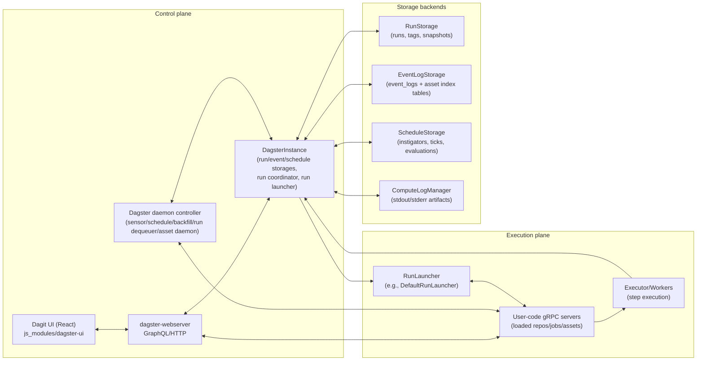

# Dagster — Architecture & Pattern Extraction for Artifact-First Partitioned Orchestration

> **Scope & evidence discipline**  
> This report is derived **only** from the provided Dagster repository snapshot and in-repo code/docs. Every architectural claim about Dagster is backed by **concrete code evidence** (file paths + identifiers, with line numbers where feasible). Where evidence is missing, I explicitly say **“Unknown from code inspected”** and list what I searched.

---

## 1) Repo & Build Metadata

### 1.1 Snapshot identity

- **Commit hash:** **Unknown from code inspected.**  
  Evidence situation:
  - The provided snapshot is a ZIP without a `.git/` directory (no git metadata).  
  - I searched for embedded commit identifiers: `GIT_SHA`, `GIT_COMMIT`, `COMMIT_SHA`, `__commit__` (no hits found).  
  - Therefore, commit hash cannot be proven from the snapshot contents.

- **Dagster package version string:** `__version__ = "1!0+dev"`  
  Evidence: `python_modules/dagster/dagster/version.py:1-2 (__version__)`

### 1.2 Monorepo layout (high-level)

Key top-level directories and what they contain:

- `python_modules/dagster/` — Dagster core runtime (definitions, execution engine, storages, daemon, gRPC).  
  Evidence: e.g. `python_modules/dagster/dagster/_core/...`, `python_modules/dagster/dagster/_daemon/...`, `python_modules/dagster/dagster/_grpc/...`

- `python_modules/dagster-webserver/` — webserver process hosting the Dagster UI backend and GraphQL API.  
  Evidence: `python_modules/dagster-webserver/dagster_webserver/webserver.py:1-150 (DagsterWebserver)`

- `python_modules/dagster-graphql/` — GraphQL schema + resolvers used by Dagit/UI.  
  Evidence: `python_modules/dagster-graphql/dagster_graphql/schema/asset_graph.py:* (GrapheneAssetNode, staleStatus, latestMaterializationByPartition, etc.)`

- `js_modules/dagster-ui/` — React UI (Dagit front-end) and shared UI packages.  
  Evidence: `js_modules/dagster-ui/packages/ui-core/src/...` (see UI section)

- `python_modules/libraries/` — integration libraries (not analyzed deeply here because your goals focus on orchestration core).  
  Evidence: directory presence.

### 1.3 Runtime components & where they live

Dagster’s runtime splits cleanly into control-plane vs execution-plane processes:

1) **Dagster core library**
- Definitions, execution, instance, storage interfaces/implementations.  
  Evidence: `python_modules/dagster/dagster/_core/*`

2) **Dagster daemon process**
- A controller that runs multiple “daemons” (sensor loop, schedule loop, backfill loop, run coordinator dequeuer, etc.) in threads.  
  Evidence:  
  - `python_modules/dagster/dagster/_daemon/controller.py:1-220 (DagsterDaemonController)`  
  - `python_modules/dagster/dagster/_daemon/daemon.py:65-146 (DagsterDaemon.run_daemon_loop)`  
  - Loop hooks invoked: `execute_sensor_iteration_loop`, `execute_scheduler_iteration_loop`, `execute_backfill_iteration_loop` imported in `daemon.py:25-34`.

3) **Dagit / webserver**
- Web server that serves the app and exposes GraphQL.  
  Evidence: `python_modules/dagster-webserver/dagster_webserver/webserver.py:1-150 (DagsterWebserver)`  
  (GraphQL schema in `python_modules/dagster-graphql/dagster_graphql/schema/*`.)

4) **User-code gRPC server**
- Isolates user code (repositories/jobs/assets) behind a gRPC boundary.  
  Evidence:
  - `python_modules/dagster/dagster/_core/remote_representation/grpc_server_registry.py:30-220 (GrpcServerRegistry, GrpcServerProcess usage)`  
  - Run launching uses gRPC info tags: `python_modules/dagster/dagster/_core/launcher/default_run_launcher.py:70-119 (DefaultRunLauncher.launch_run)`.

5) **Storage layers (pluggable backends)**
- **Event log storage** (append-like log of Dagster events + asset index tables).  
  Evidence: `python_modules/dagster/dagster/_core/storage/event_log/*`  
  - SQL schema: `python_modules/dagster/dagster/_core/storage/event_log/schema.py:20-123 (EventLogStorageTable, AssetKeyTable, AssetEventTagsTable, …)`  
- **Run storage** (runs table + tags + snapshots).  
  Evidence: `python_modules/dagster/dagster/_core/storage/runs/schema.py:19-120 (RunsTable, RunTagsTable, …)`  
- **Schedule/Sensor state storage** (“instigators” & “ticks” & automation eval history).  
  Evidence: `python_modules/dagster/dagster/_core/storage/schedules/schema.py:27-146 (InstigatorsTable, JobTicksTable, AssetDaemon* tables)`

### 1.4 Module map (major subsystems)

| Subsystem | Primary code location(s) | Evidence |
|---|---|---|
| Definitions (assets/jobs/ops/graphs) | `python_modules/dagster/dagster/_core/definitions/*` | `AssetsDefinition` in `.../assets/definition/assets_definition.py:69-150` |
| Asset graph | `python_modules/dagster/dagster/_core/definitions/assets/graph/*` | `AssetGraph`, `AssetNode` in `.../asset_graph.py:33-220` |
| Partitions | `python_modules/dagster/dagster/_core/definitions/partitions/*` | `PartitionsDefinition` in `.../definition/partitions_definition.py:39-207`; `TimeWindowPartitionsDefinition` in `.../definition/time_window.py:*` |
| Sensors | `python_modules/dagster/dagster/_core/definitions/sensor_definition.py`, `.../asset_sensor_definition.py`, daemon loop `dagster/_daemon/sensor.py` | `SensorEvaluationContext.update_cursor` in `sensor_definition.py:383-401`; `AssetSensorDefinition` cursor logic in `asset_sensor_definition.py:97-152`; daemon dedup in `sensor.py:1288-1422` |
| Schedules | `python_modules/dagster/dagster/_core/definitions/schedule_definition.py` and scheduler loop `python_modules/dagster/dagster/_scheduler/scheduler.py` | Schedule run dedup by run_key in `.../_scheduler/scheduler.py:915-1036` |
| Auto-materialize / automation | `python_modules/dagster/dagster/_daemon/asset_daemon.py`, `.../_core/definitions/declarative_automation/*` | `AssetDaemonTickContext` state in `asset_daemon.py:243-314`; automation conditions incl. checks in `automation_condition.py:457-498` |
| Run coordination / queueing | `python_modules/dagster/dagster/_core/run_coordinator/*` and dequeuer daemon `dagster/_daemon/run_coordinator/*` | `QueuedRunCoordinator.submit_run` in `queued_run_coordinator.py:306-366`; dequeuer logic in `queued_run_coordinator_daemon.py:350-541` |
| Run launching | `python_modules/dagster/dagster/_core/launcher/*` | `DefaultRunLauncher.launch_run` in `default_run_launcher.py:70-119` |
| Event log storage + asset index | `python_modules/dagster/dagster/_core/storage/event_log/*` | SQL schema `event_log/schema.py:*`; write path `sql_event_log.py:232-512` |
| Run storage | `python_modules/dagster/dagster/_core/storage/runs/*` | schema `runs/schema.py:*`; status update `sql_run_storage.py:164-236` |
| Asset catalog / asset graph queries | `python_modules/dagster/dagster/_core/asset_graph_view/*` + GraphQL schema `dagster_graphql/schema/asset_graph.py` | `AssetGraphView` in `asset_graph_view.py:68-150`; UI-facing fields in `asset_graph.py:700-820`, `1000-1078` |
| Compute logs / IO managers | `python_modules/dagster/dagster/_core/storage/compute_log_manager.py`, `.../local_compute_log_manager.py`, `.../io_manager.py` | `ComputeLogManager` in `compute_log_manager.py:1-120`; `LocalComputeLogManager` in `local_compute_log_manager.py:45-120`; `IOManager` in `io_manager.py:133-204` |

---

## 2) Underlying Formalism: Assets + Partitions + Materializations as a Transition System

This section models Dagster using explicit notation and ties each formal element to code.

### 2.1 Asset graph

**Formalism**

- Let **asset keys** be the node identifiers:
  - \(A = \{\texttt{AssetKey}\}\)

- Let **dependencies** define directed edges:
  - \(E \subseteq A \times A\)  
  - Interpret \((u, v) \in E\) as “asset \(v\) depends on upstream asset \(u\)”.

- Define the asset graph:
  - \(G = (A, E)\)

**Dagster implementation mapping**

- Nodes are represented by `AssetKey` objects.
  - Evidence: `python_modules/dagster/dagster/_core/definitions/asset_key.py:33-115 (class AssetKey)`

- Dagster’s in-memory graph structure is `AssetGraph` containing `AssetNode` objects keyed by `AssetKey`.
  - Evidence:
    - `python_modules/dagster/dagster/_core/definitions/assets/graph/asset_graph.py:33-123 (class AssetNode)`
    - `python_modules/dagster/dagster/_core/definitions/assets/graph/asset_graph.py:126-220 (class AssetGraph, from_assets)`

- Edges are derived from each asset’s `AssetSpec.deps` (dependency specs) via `generate_asset_dep_graph`, which constructs upstream and downstream adjacency sets.
  - Evidence:
    - `python_modules/dagster/dagster/_core/selector/subset_selector.py:12-62 (generate_asset_dep_graph)`
    - `AssetGraph.from_assets` calling `generate_asset_dep_graph`: `asset_graph.py:170-199`

- Within `AssetNode`, `parent_keys` and `child_keys` are the adjacency sets corresponding to \(E\).
  - Evidence: `asset_graph.py:45-63 (AssetNode.__init__, parent_keys/child_keys)` and usage in `AssetGraph.__init__` construction `asset_graph.py:141-168`

**Reusable formal observation for our platform**

Your invariant talks about steps \(s\) and input datasets \(I(s)\). Dagster’s assets are *already a step-like dependency DAG*: for assets-as-nodes execution, you can think of each asset \(a\) as a “step”, and its inputs \(I(a)\) are its upstream `parent_keys`.

---

### 2.2 Partitions

**Formalism**

- For a partitioned asset \(a\), define a set of partitions:
  - \(P(a)\) = the partition keys for asset \(a\)

- If partitions have explicit data intervals, define:
  - \(\text{interval}(a, p) = [t_{start}(p), t_{end}(p))\)

**Dagster implementation mapping**

- Partitioning is attached to assets via `partitions_def` on the asset node/spec. `AssetNode.is_partitioned` is true iff `partitions_def` exists.
  - Evidence:
    - `AssetNode.is_partitioned`: `python_modules/dagster/dagster/_core/definitions/assets/graph/asset_graph.py:102-105`
    - `AssetsDefinition(..., partitions_def=...)`: `python_modules/dagster/dagster/_core/definitions/assets/definition/assets_definition.py:69-150`

- The abstract interface is `PartitionsDefinition`, which defines how to enumerate partition keys and how to translate a key to tags.
  - Evidence: `python_modules/dagster/dagster/_core/definitions/partitions/definition/partitions_definition.py:39-207 (class PartitionsDefinition)`

- Dagster *does* model explicit time windows (data intervals) through `TimeWindow` and `TimeWindowPartitionsDefinition`.
  - `TimeWindow(start, end)` is explicitly “closed-open” \([start, end)\).
    - Evidence: `python_modules/dagster/dagster/_core/definitions/partitions/utils/time_window.py:11-49 (class TimeWindow)`
  - `TimeWindowPartitionsDefinition.time_window_for_partition_key()` maps a partition key string to a `TimeWindow`.
    - Evidence: `python_modules/dagster/dagster/_core/definitions/partitions/definition/time_window.py:534-602 (time_window_for_partition_key)`

- Daily and weekly partitions are specializations of `TimeWindowPartitionsDefinition`:
  - `DailyPartitionsDefinition`: `.../time_window_subclasses.py:99-169`
  - `WeeklyPartitionsDefinition`: `.../time_window_subclasses.py:171-258`
  - Evidence: `python_modules/dagster/dagster/_core/definitions/partitions/definition/time_window_subclasses.py:99-258`

- DST/timezone handling is explicitly accounted for in time-window partition key formatting using `dst_safe_strftime` / `dst_safe_strptime`.
  - Evidence:
    - import/use: `time_window.py:39-47, 331-338, 540-553` (DST-safe formatting/parsing)
    - `get_partition_keys` uses `dst_safe_strftime(...)`: `time_window.py:312-340`

**Reusable formal observation for our platform**

Your partitions \(p \in P\) have explicit data intervals; Dagster’s `TimeWindow` formalism is directly compatible. We can reuse:
- `partition_key ⇄ interval` mapping discipline (with DST safety)  
but we likely need our own canonical interval semantics for spreadsheets and promotion events.

---

### 2.3 Materializations (events)

**Formalism**

- Define a materialization event:
  - \(m = (a, p, metadata, timestamp, run\_id, \dots)\)

- Define a “current pointer” function (Dagster-style):
  - \(\text{latest}(a,p) \mapsto m\)  
  or sometimes to a `DataVersion` record.

**Dagster implementation mapping**

- The event payload for an asset materialization is `AssetMaterialization`, which includes:
  - `asset_key`
  - `metadata` (a mapping)
  - `partition` (string, optional)
  - `tags` (string→string, optional)
  - Evidence: `python_modules/dagster/dagster/_core/definitions/events.py:467-547 (class AssetMaterialization)`

- Materializations are stored in the event log as `EventLogEntry` records, which capture:
  - `run_id`
  - `timestamp`
  - `step_key`
  - `dagster_event` (typed payload containing e.g. materialization data)
  - Evidence: `python_modules/dagster/dagster/_core/events/log.py:29-122 (class EventLogEntry)`

- In SQL storage, the append-like event table is `event_logs` (`EventLogStorageTable`), with columns including:
  - `id` (autoincrement PK) — used as `storage_id` / cursor
  - `run_id`, `dagster_event_type`, `timestamp`
  - `asset_key`, `partition`
  - Evidence: `python_modules/dagster/dagster/_core/storage/event_log/schema.py:20-51 (EventLogStorageTable columns)`

- Write path:
  - `SqlEventLogStorage.store_event()` inserts into `event_logs` on the **run shard** and then (if asset event) updates asset index tables on the **index shard**.
  - Evidence:
    - `store_event`: `python_modules/dagster/dagster/_core/storage/event_log/sql_event_log.py:354-512`
    - shard separation: `run_connection` vs `index_connection`: `sql_event_log.py:155-187`

- The asset index table is `asset_keys` (`AssetKeyTable`), which stores `last_materialization` and `last_run_id`, plus cached status data.
  - Evidence: `python_modules/dagster/dagster/_core/storage/event_log/schema.py:53-78 (AssetKeyTable columns)`

- `SqlEventLogStorage.store_asset_event()` updates `AssetKeyTable.last_materialization` (serialized `EventLogRecord`), keyed by asset key.
  - Evidence: `sql_event_log.py:232-303 (store_asset_event)`

**How “latest(a,p)” is implemented**

There are **two** distinct “latest” mechanisms:

1) **Latest per asset (non-partition-specific)**  
   Uses `AssetKeyTable.last_materialization` for fast reads.
   - Evidence: `sql_event_log.py:1369-1413 (get_latest_materialization_events)` plus `AssetKeyTable.last_materialization` column `schema.py:60-63`

2) **Latest per asset partition**  
   Uses a query over the `event_logs` table selecting `max(id)` grouped by `partition`.
   - Evidence: `sql_event_log.py:1884-1943 (get_latest_storage_id_by_partition)`

UI/GraphQL explicitly implements “latest materialization by partition” by:
- calling `event_log_storage.get_latest_storage_id_by_partition(...)`
- fetching those storage IDs’ materialization events
- returning a mapping partition → `GrapheneMaterializationEvent`
- Evidence: `python_modules/dagster-graphql/dagster_graphql/schema/asset_graph.py:1000-1078 (resolve_latestMaterializationByPartition)`

---

### 2.4 State and transition function

**Formalism**

Define a minimal Dagster operational state:

- \(S = (\text{Catalog}, \text{Runs}, \text{EventLog}, \text{Instigators})\) where:
  - **Catalog**: asset index + derived views (latest materializations, cached partition subsets, stale status caches)
  - **Runs**: run records + status
  - **EventLog**: append-like event log entries
  - **Instigators**: schedules/sensors state, ticks, cursors

Define transition:
- \(\delta: (S, e) \rightarrow S\)

Where events \(e\) include:
- `sensor_tick`, `schedule_tick`
- `run_enqueued`, `run_starting`, `run_started`, `run_succeeded`, `run_failed`
- `step_*` events and `asset_materialization` events

**Dagster implementation mapping**

- The concrete “state container” is `DagsterInstance`, which owns:
  - `run_storage`, `event_storage`, `schedule_storage`, `compute_log_manager`, `run_launcher`, `run_coordinator`, etc.
  - Evidence: `python_modules/dagster/dagster/_core/instance/instance.py:66-150 (DagsterInstance.__init__ fields)`

- Core transition “append event + update derived state” is `DagsterInstance.handle_new_event()`:
  - It writes events into the event log storage (`event_storage.store_event(...)`), then updates run storage on job-related events via `run_storage.handle_run_event(...)`.
  - Evidence:
    - `handle_new_event`: `python_modules/dagster/dagster/_core/instance/methods/event_methods.py:154-214`
    - run updates: `sql_run_storage.py:164-236 (handle_run_event)`

- Run status state machine is represented by:
  - `DagsterRunStatus` enum (NOT_STARTED → QUEUED/STARTING/STARTED → SUCCESS/FAILURE/…).
  - Evidence: `python_modules/dagster/dagster/_core/storage/dagster_run.py:32-71 (class DagsterRunStatus)`
  - Event-type-to-status mapping is `EVENT_TYPE_TO_PIPELINE_RUN_STATUS`.
  - Evidence: `python_modules/dagster/dagster/_core/events/__init__.py:241-269`

- Instigator (sensor/schedule/automation) state is persisted via:
  - `InstigatorState` (per sensor/schedule), containing `instigator_data` which includes cursor and last run key.
    - Evidence: `python_modules/dagster/dagster/_core/scheduler/instigation.py:272-340 (class InstigatorState)`
  - `InstigatorTick` / `TickData` for each evaluation tick, storing run IDs, run keys, cursor, and reserved run IDs.
    - Evidence: `instigation.py:414-477 (InstigatorTick)` and `instigation.py:502-614 (TickData)`

- Daemon loops drive transitions by polling:
  - `DagsterDaemon.run_daemon_loop` repeatedly calls `core_loop(...)` generators, handles restarts, emits heartbeats.
  - Evidence: `python_modules/dagster/dagster/_daemon/daemon.py:88-146`
  - `DagsterDaemonController` starts daemon threads.
  - Evidence: `python_modules/dagster/dagster/_daemon/controller.py:99-220`

---

### 2.5 Compare Dagster semantics to our core invariant

Your platform invariants (restated with emphasis):

- Partitions \(p \in P\) with explicit **data intervals**
- Immutable spreadsheet artifacts: each edit yields a new version \(v\) (checksum + metadata)
- Registry pointer `active(d,p) -> v`, but only **promoted** inputs drive eligibility
- Event-driven orchestration from materialization/promotion events
- Run \(r=(s,p)\) eligible iff \(\forall d\in I(s): active(d,p)\) exists **and is promoted**
- Run captures exact input versions at start; stale if any active(d,p) changes afterward
- Runs immutable; corrections via new artifact versions + rerun/backfill
- Task code can spawn child run or execute-and-wait with durable waiting
- Guardrails: max depth, max spawned runs, cycle detection, tenant circuit breaker
- Append-only event log + lineage (inputs→outputs), structured analytics history
- UI: partition grid, partition detail, run detail (lineage + logs + child runs), dataset registry (version history + promote)

**Mapping our `active(d,p) -> v` to Dagster**

- Dagster’s closest built-in “pointer” is `latest(asset_key, partition)`:
  - for partitions: computed via `get_latest_storage_id_by_partition` and fetching events by storage ID.
  - Evidence: `sql_event_log.py:1884-1943` + GraphQL resolver `asset_graph.py:1000-1078`

- Dagster also supports a “data version” abstraction that can encode checksums:
  - `DataVersion` is a wrapper around a `str` value.
  - Evidence: `python_modules/dagster/dagster/_core/definitions/data_version.py:46-66 (class DataVersion)`
  - Data version tags/constants:
    - `DATA_VERSION_TAG = "dagster/data_version"`
    - Evidence: `data_version.py:159-166`

**What Dagster lacks for “promotion gating”**

From code inspected, Dagster does **not** have a first-class notion of “promoted pointer” distinct from “latest materialization.” The asset catalog’s “latest” is always based on **latest event** (by stored record / max storage id).  
Evidence: `SqlEventLogStorage.get_latest_storage_id_by_partition` chooses `max(id)` per partition (`sql_event_log.py:1911-1943`), i.e. it does not filter for “approved/promoted”.

**Dagster primitives that could implement promotion gating anyway**

Two Dagster-native building blocks stand out (with evidence):

1) **Blocking asset checks** as a gate
- Asset checks have a `blocking` flag with explicit semantics: “downstream assets won’t execute” (docstring + param).
  - Evidence: `python_modules/dagster/dagster/_core/definitions/asset_checks/asset_check_spec.py:37-71`
- Asset-job dependency wiring explicitly includes “blocking asset checks” as dependencies of downstream nodes.
  - Evidence: `python_modules/dagster/dagster/_core/definitions/assets/job/asset_job.py:399-485 (build_node_deps, BlockingAssetChecksDependencyDefinition insertion)`

2) **Declarative automation conditions** referencing checks
- `AutomationCondition.check_passed(...)` and `.check_failed(...)` exist as primitives.
  - Evidence: `python_modules/dagster/dagster/_core/definitions/declarative_automation/automation_condition.py:457-498`

---

## 3) Execution Architecture Deep Dive

### 3.1 Control plane vs execution plane

---

## 10) Mapping to Our Platform (MUST be a table)

| Our requirement/invariant | Dagster concept | Code evidence | What to reuse | Adaptation work | Risks |
|---|---|---|---|---|---|
| **partition_key + data interval semantics** | `PartitionsDefinition` + `TimeWindowPartitionsDefinition` + `TimeWindow(start,end)` | `partitions_definition.py:39-207`; `time_window.py:534-602`; `utils/time_window.py:11-49` | Reuse time-window partition formalism, timezone + DST-safe formatting | Align interval semantics with our “explicit data interval” model; canonical partition keys | DST edge cases require strict testing |
| **event-driven eligibility from promotion** | Asset sensor cursor over `storage_id` + run_key dedup; automation conditions reference checks | `asset_sensor_definition.py:97-152`; `sensor.py:1288-1422`; `automation_condition.py:457-498` | Cursor-as-storage_id + run_key idempotency | Add `artifact.promoted` event and `latest_promoted(d,p)` pointer | Polling latency; races if promotion not idempotent |

---

## 12) Actionable Output

### 12.3 Reference architecture paragraph

Adopt Dagster’s strongest architectural ideas—**an explicit asset dependency graph**, a **monotonic event log** with **cursor-based consumers**, and **idempotent run submission** via **run keys** and **reserved run IDs**—but re-implement the “current pointer” semantics to match our artifact-first model. Specifically: keep an append-only lineage log (input versions → output versions) and a fast “latest view,” but define the authoritative pointer as **`active(d,p) = latest_promoted_version`**, not “latest materialization.” Implement staleness and eligibility checks against **promoted pointers** (not raw edits), and make child-run spawning a first-class control-plane feature with budgeted recursion, deterministic ids, and durable waiting. Reuse Dagit’s partition-grid and stale-cause UX patterns, but extend them with promotion history, “why blocked” explanations, and dataset registry promotion actions.
