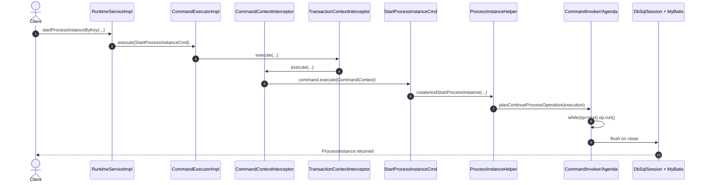
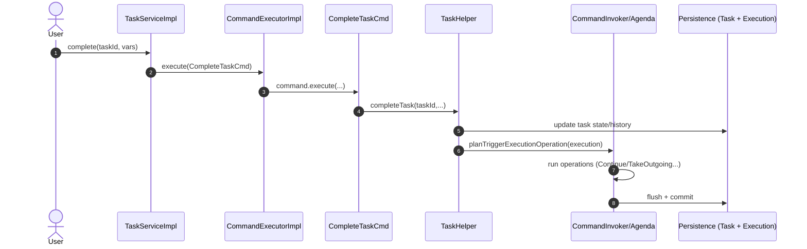
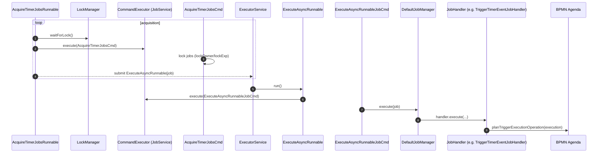

# Flowable Engine — Architecture & Pattern Extraction for Artifact-First Partitioned Orchestration

> Repository analyzed from local zip snapshot: `flowable-engine-main.zip` (directory `flowable-engine-main/`).

---

## 1) Repo & Build Metadata

### Commit hash
**Unknown from code inspected.**  
The snapshot does **not** include a `.git/` directory, and I did not find generated build artifacts like `git.properties` that would embed the commit id. I searched for:
- `.git/HEAD`, `.git/refs/*` (not present)
- `git.properties`, `git.commit.*` strings (not found)

### Build system and root coordinates
Flowable Engine is a **multi-module Maven** build with a root `pom.xml` declaring modules and shared properties.  
Evidence: `pom.xml` with `<packaging>pom</packaging>` and a large `<modules>` block. (`pom.xml:1-93`)

- Project version in this snapshot: **`8.0.0-SNAPSHOT`** (`pom.xml:13-17`)
- Build is module-driven through the root `<modules>` list. (`pom.xml:36-93`)

### Modules list (top-level)
From the root `pom.xml`, the primary modules include (non-exhaustive excerpt, but representative of the runtime architecture):  
`modules/flowable-engine`, `modules/flowable-engine-common`, `modules/flowable-job-service`, `modules/flowable-task-service`, `modules/flowable-variable-service`, plus CMMN/DMN engines, identity link service, event registry, HTTP, UI/common modules, etc.  
Evidence: `pom.xml` `<modules>` entries. (`pom.xml:36-93`)

### Main runtime entrypoints
Flowable is an **embeddable engine** whose “entrypoints” are *configuration builders* that construct engine instances:

- **BPMN / Process Engine**
  - Static helpers to create configuration from classpath resources:  
    `ProcessEngineConfiguration.createProcessEngineConfigurationFromResourceDefault()` and friends.  
    Evidence: `modules/flowable-engine/src/main/java/org/flowable/engine/ProcessEngineConfiguration.java` static factory methods. (`ProcessEngineConfiguration.java:157-213`)
  - Engine construction uses `ProcessEngineConfigurationImpl.createEngine()` which returns `new ProcessEngineImpl(this)`.  
    Evidence: `ProcessEngineConfigurationImpl.createEngine()`. (`ProcessEngineConfigurationImpl.java:878-881`)
  - Engine “boot” starts executors (async job executor, async history) in the `ProcessEngineImpl` constructor.  
    Evidence: `ProcessEngineImpl` constructor calls `startExecutors()` when configured. (`ProcessEngineImpl.java:82-112`)

- **CMMN Engine**
  - Built via `CmmnEngineConfiguration` (also an `AbstractBuildableEngineConfiguration`).  
    Evidence: class declaration and services composition. (`CmmnEngineConfiguration.java:333-350`)

- **DMN Engine**
  - Built via `DmnEngineConfiguration` (and a DMN agenda).  
    Evidence: `DefaultDmnEngineAgenda` and `DmnEngineConfiguration` hit-policy setup. (`DefaultDmnEngineAgenda.java:38-69`, `DmnEngineConfiguration.java:596-640`)

### “Map” of packages/modules relevant to runtime execution and persistence

#### BPMN runtime (orchestration core)
- **Execution semantics & agenda:**  
  `org.flowable.engine.impl.agenda.*` (agenda + operations)  
  Evidence: `DefaultFlowableEngineAgenda` wires which operations exist. (`DefaultFlowableEngineAgenda.java:43-92`)
- **Behavior implementations (BPMN node semantics):**  
  `org.flowable.engine.impl.bpmn.behavior.*` (user tasks, service tasks, call activity, external worker, etc.)  
  Evidence: e.g., `UserTaskActivityBehavior`, `CallActivityBehavior`, `ExternalWorkerTaskActivityBehavior`. (`UserTaskActivityBehavior.java:69-143`, `CallActivityBehavior.java:106-239`, `ExternalWorkerTaskActivityBehavior.java:60-125`)
- **Public services backed by commands:**  
  `org.flowable.engine.impl.*ServiceImpl`  
  Evidence: `RuntimeServiceImpl` and `TaskServiceImpl` route calls to `commandExecutor.execute(...)`. (`RuntimeServiceImpl.java:105-132`, `TaskServiceImpl.java:234-272`)

#### Cross-cutting infrastructure (command, tx, db)
- **Command execution + interceptors (transaction, retry, context):**  
  `org.flowable.common.engine.impl.interceptor.*` + engine-specific `CommandInvoker`  
  Evidence: interceptor chain wiring in `AbstractEngineConfiguration.initCommandInterceptors()`. (`AbstractEngineConfiguration.java:568-618`)  
  Evidence: `CommandInvoker` executes agenda operations. (`CommandInvoker.java:64-92`)
- **DB session + optimistic locking:**  
  `org.flowable.common.engine.impl.db.DbSqlSession`  
  Evidence: optimistic-lock failure detection on update count. (`DbSqlSession.java:380-423`)
- **MyBatis mapping layer:**  
  e.g., `modules/flowable-engine/src/main/resources/org/flowable/db/mapping/entity/Execution.xml`  
  Evidence: MyBatis namespace and SQL statements. (`Execution.xml:3-52`)

#### Durable async execution (jobs)
- **Job acquisition + execution:**  
  `org.flowable.job.service.impl.asyncexecutor.*`  
  Evidence: `AcquireTimerJobsRunnable` polling/acquire loop. (`AcquireTimerJobsRunnable.java:92-176`, `AcquireTimerJobsRunnable.java:237-264`)  
  Evidence: `ExecuteAsyncRunnable` job execution + failure handling. (`ExecuteAsyncRunnable.java:94-165`, `ExecuteAsyncRunnable.java:217-244`)
- **Job locking & retry/deadletter:**  
  Evidence: lock fields set during acquisition. (`AcquireTimerJobsCmd.java:49-89`)  
  Evidence: decrement retries / deadletter move via cloning job rows. (`DefaultJobManager.java:397-476`)

#### Persistence schemas
- BPMN engine schema (executions, procdefs, event log, etc.):  
  Evidence: `flowable.h2.create.engine.sql`. (`flowable.h2.create.engine.sql:32-73`, `flowable.h2.create.engine.sql:75-90`, `flowable.h2.create.engine.sql:160-186`)
- “Common” schema (tasks, identity links, event subscriptions, variables, jobs, history):  
  Evidence: `flowable.h2.create.common.sql`. (`flowable.h2.create.common.sql:48-74`, `flowable.h2.create.common.sql:110-170`, `flowable.h2.create.common.sql:176-360`, `flowable.h2.create.common.sql:380-560`)
- CMMN schema:  
  Evidence: `flowable.h2.create.cmmn.sql` (case instance + plan item instance state). (`flowable.h2.create.cmmn.sql:52-123`)
- DMN schema:  
  Evidence: `flowable.h2.create.dmn.sql` (decision defs + historic decision exec). (`flowable.h2.create.dmn.sql:1-7`)

---

## 2) Underlying Formalism: BPMN/CMMN/DMN as Operational Semantics

This section is written “from first principles” and then pinned to **exact code loci** where Flowable implements the semantics.

### 2.1 BPMN as an operational model

#### Process definition as a graph
Let a BPMN process definition be a directed graph:

- **Graph:** \( G = (V, E) \)
  - \( V \) are BPMN *flow nodes* (tasks, gateways, events, subprocesses, …)
  - \( E \subseteq V \times V \) are *sequence flows* (possibly guarded by conditions)

In Flowable’s in-memory BPMN model:
- A node (flow node) explicitly stores incoming/outgoing sequence flows.  
  Evidence: `FlowNode` has `incomingFlows` and `outgoingFlows`. (`FlowNode.java:32-34`, plus getters `getOutgoingFlows()` etc. `FlowNode.java:98-113`)
- An edge (sequence flow) stores `sourceRef`, `targetRef`, condition expressions, and also caches parsed `sourceFlowElement`/`targetFlowElement`.  
  Evidence: `SequenceFlow` fields. (`SequenceFlow.java:26-39`)
- A `Process` stores a `flowElementMap` and `initialFlowElement` set during parsing.  
  Evidence: `Process.flowElementMap` + `initialFlowElement`. (`Process.java:41-46`)

So, at the definitional level, Flowable’s BPMN runtime works with an explicit graph-like structure that is *sufficient* to interpret a transition system over nodes and edges.

#### Runtime state as a token/execution structure (Petri-net style, but with scope)
A classical Petri-net marking \( M \) is a multiset of tokens over places. BPMN has richer scope/variable semantics, so we model Flowable’s runtime state as:

- \( \Sigma \) = variable store (persistent process variables + local variables)
- \( \mathcal{E} \) = set of active “executions” (tokens), each with:
  - current node \( \ell(e) \in V \) (or `null` for special scopes)
  - identifiers and scope relations (parent/child)
  - flags controlling concurrency and scope

Flowable’s concrete representation is the **execution tree**:
- `ExecutionEntityImpl` contains fields for:
  - `activityId`, `currentFlowElement` (current position in the model)
  - hierarchical structure: `parent`, `executions` list, `processInstanceId`
  - concurrency/scope flags: `isActive`, `isConcurrent`, `isScope`, `isEventScope`, `isMultiInstanceRoot`  
  Evidence: `ExecutionEntityImpl` fields. (`ExecutionEntityImpl.java:43-108`, `ExecutionEntityImpl.java:190-207`)
- Database persistence mirrors the same: `ACT_RU_EXECUTION` stores `ACT_ID_`, `IS_ACTIVE_`, `IS_CONCURRENT_`, `IS_SCOPE_`, `IS_EVENT_SCOPE_`, etc.  
  Evidence: schema columns. (`flowable.h2.create.engine.sql:32-73`)

This is exactly the structure you’d want for a partitioned pipeline model as well: a run’s state can be a token positioned at a step node, with explicit scoping for subruns (call activity) and concurrency for fan-out.

#### Transition function \( \delta \)
Define an operational semantics via a transition function:

\[
\delta : (\text{State}, \text{Event}) \rightarrow \text{State}
\]

But Flowable uses **micro-steps** executed until quiescence in a single command/transaction. Concretely:
- “Events” include API calls (start process, complete task), job fires, message receipts, etc.
- Each event creates/uses an **agenda** of operations; operations implement small-step transitions.

**Key implementation fact:** Flowable’s BPMN semantics are encoded as a queue of **`Runnable` operations** (agenda operations), executed by `CommandInvoker` until empty.
- The `CommandInvoker` loops: while agenda has operation → run it.  
  Evidence: `CommandInvoker.execute()` uses `agenda.getNextOperation()` and `operation.run()`. (`CommandInvoker.java:64-92`)
- The agenda itself is a prioritized operation queue with optional “future operations” (in-memory futures).  
  Evidence: `AbstractAgenda` manages `operations` and `futureOperations`. (`AbstractAgenda.java:31-90`)

##### Where node semantics live: Activity behaviors + agenda operations
The core BPMN “token game” is implemented by the interplay of:
- `ContinueProcessOperation` (continue execution at current flow element / node)  
  Evidence: class and logic for synchronous vs async. (`ContinueProcessOperation.java:120-129`, `ContinueProcessOperation.java:148-197`)
- `TakeOutgoingSequenceFlowsOperation` (evaluate outgoing flows, conditions, async leave, plan next steps)  
  Evidence: top-level control flow + async-leave handling. (`TakeOutgoingSequenceFlowsOperation.java:81-114`, `TakeOutgoingSequenceFlowsOperation.java:130-145`, `TakeOutgoingSequenceFlowsOperation.java:198-239`)
- Activity behaviors for node types (e.g., `UserTaskActivityBehavior`, `CallActivityBehavior`, `ExternalWorkerTaskActivityBehavior`) which implement the semantics of specific nodes.  
  Evidence: examples in section 5/7, but notably `UserTaskActivityBehavior.execute`. (`UserTaskActivityBehavior.java:69-143`)

##### A concrete “token transition” in code
When an execution traverses a sequence flow, Flowable explicitly:
1. Sets the execution’s `currentFlowElement` to the target node.
2. Sets it active.
3. Plans a `ContinueProcessOperation` (i.e., schedule next micro-step).
4. Records history that the sequence flow was taken.

Evidence: `ContinueProcessOperation.continueThroughSequenceFlow(...)` does exactly this.  
- Sets `execution.setCurrentFlowElement(...)` and `execution.setActive(true)`, then `agenda.planContinueProcessOperation(execution)`  
  Evidence: (`ContinueProcessOperation.java:345-354`)

This is a direct implementation of a graph transition rule:
\[
(e \text{ at } u) \xrightarrow{\text{take flow } (u\to v)} (e \text{ at } v)
\]

### 2.2 Durable waiting and event-triggered transitions (BPMN)

Flowable supports “waiting states” (human tasks, timers, message catches) by **persisting state** and then advancing only when an external trigger arrives.

#### Human task wait
At a user task node, Flowable **creates a `TaskEntity` and does not auto-leave**:
- `UserTaskActivityBehavior.execute` creates a task, inserts it, and sets assignments; it does not call `leave(execution)` in the normal path, so the execution remains positioned at the user task.  
  Evidence: task creation + insert. (`UserTaskActivityBehavior.java:69-110`, `UserTaskActivityBehavior.java:115-143`)

Completion triggers resumption:
- `TaskServiceImpl.complete(...)` executes `CompleteTaskCmd`.  
  Evidence: `TaskServiceImpl.complete` methods. (`TaskServiceImpl.java:234-272`)
- `TaskHelper.completeTask(...)` completes the task and then **plans `planTriggerExecutionOperation(executionEntity)`** to resume the process.  
  Evidence: `TaskHelper` continues process after completion. (`TaskHelper.java:178-185`)

This is fundamentally “event-driven” (a user action) and does **not** require a timer poller.

#### Message/event wait
For message catch events, Flowable persists **event subscriptions** and triggers them upon message receipt:
- `MessageEventReceivedCmd` finds event subscriptions and calls `EventSubscriptionUtil.eventReceived(...)`.  
  Evidence: `MessageEventReceivedCmd.execute`. (`MessageEventReceivedCmd.java:57-93`)
- `EventSubscriptionUtil.eventReceived(...)` either handles synchronously or schedules an async job (`ProcessEventJobHandler`) via `scheduleEventAsync`.  
  Evidence: sync/async branching and job creation path. (`EventSubscriptionUtil.java:60-109`, `EventSubscriptionUtil.java:129-155`)
- Persistence table: `ACT_RU_EVENT_SUBSCR` with `EVENT_TYPE_`, `EVENT_NAME_`, `EXECUTION_ID_`, `PROC_INST_ID_` etc.  
  Evidence: schema. (`flowable.h2.create.common.sql:110-143`)

This maps cleanly to your platform’s **`artifact.promoted`** event: you can interpret “promotion” as a message event and wake eligible runs.

#### Timer wait
Timers are also durable (stored as timer jobs), but the firing mechanism is implemented via a background acquisition loop (polling the DB), plus “hinting” for low latency.

- Job schema includes timer jobs: `ACT_RU_TIMER_JOB` with `DUEDATE_`, lock fields, retries, etc.  
  Evidence: `ACT_RU_TIMER_JOB` columns. (`flowable.h2.create.common.sql:228-261`)
- Acquisition loop: `AcquireTimerJobsRunnable` repeatedly runs, acquires a global lock, and queries/locks due jobs; it waits using `MONITOR.wait(millisToWait)` between cycles.  
  Evidence: loop + timed waits. (`AcquireTimerJobsRunnable.java:92-176`, `AcquireTimerJobsRunnable.java:237-264`)
- When a timer job executes, a timer job handler typically resumes execution by planning a trigger:
  - `TriggerTimerEventJobHandler.execute(...)` calls `agenda.planTriggerExecutionOperation(executionEntity)` and dispatches a TIMER_FIRED event.  
    Evidence: (`TriggerTimerEventJobHandler.java:39-47`)

**So:**
- Human waits and message waits are “push” (API/event driven).
- Timer waits are durable but executed via a polling acquisition thread (with wait intervals), not purely push-driven.  
  Evidence: acquisition runnable behavior above.

### 2.3 CMMN as an operational model

CMMN is not a pure token-on-graph model; it’s a **lifecycle state machine** over “plan item instances” (tasks, stages, milestones) under sentry criteria.

A useful formalization is:
- A case definition contains plan items \( PI \).
- Runtime state includes:
  - case instance state \( s_{case} \)
  - plan item instance states \( s_{pi} \in \{\text{available}, \text{enabled}, \text{active}, \text{completed}, \text{terminated}, ...\} \)
  - sentry parts and criteria evaluation results

Flowable persists this explicitly:
- `ACT_CMMN_RU_CASE_INST` includes `STATE_`, lock fields, timestamps, tenant, etc.  
  Evidence: (`flowable.h2.create.cmmn.sql:52-75`)
- `ACT_CMMN_RU_PLAN_ITEM_INST` includes `STATE_`, lifecycle timestamps, `ENTRY_CRITERION_ID_`, `EXIT_CRITERION_ID_`, etc.  
  Evidence: (`flowable.h2.create.cmmn.sql:84-123`)

Operational semantics are implemented via a CMMN agenda:
- `DefaultCmmnEngineAgenda` wires operations and defers criteria evaluation to the end of a command.  
  Evidence: comment and operation selection. (`DefaultCmmnEngineAgenda.java:46-105`, `DefaultCmmnEngineAgenda.java:106-144`)
- `EvaluateCriteriaOperation` evaluates criteria and can plan terminate/complete case operations.  
  Evidence: (`EvaluateCriteriaOperation.java:52-110`)

### 2.4 DMN as an operational model

DMN decision evaluation is best modeled as a function:
\[
f_d : \text{Inputs} \rightarrow \text{DecisionResult}
\]
with **hit policies** defining how multiple matching rules are aggregated.

Flowable models hit policies as pluggable behaviors:
- `DmnEngineConfiguration` initializes `hitPolicyBehaviors` mapping `HitPolicy` → behavior impl (Unique, Any, Priority, First, Collect, RuleOrder, OutputOrder).  
  Evidence: (`DmnEngineConfiguration.java:596-640`)

DMN runtime semantics are executed by the DMN agenda:
- `DefaultDmnEngineAgenda` returns an `ExecuteDecisionOperation` or similar and runs operations until empty.  
  Evidence: (`DefaultDmnEngineAgenda.java:38-69`)
- `ExecuteDecisionOperation.run()` uses the configured `RuleEngineExecutor` and stores audit results on the command context.  
  Evidence: (`ExecuteDecisionOperation.java:47-80`)
- The actual evaluation path goes through `RuleEngineExecutorImpl.executeDecision(...)` and constructs audit containers; this is the concrete interpreter of DMN rules.  
  Evidence: (`RuleEngineExecutorImpl.java:71-123`, `RuleEngineExecutorImpl.java:141-165`)

BPMN integrates DMN as a node behavior:
- `DmnActivityBehavior.execute(...)` calls `DmnDecisionService.createExecuteDecisionBuilder()`, passes execution variables and tenant id, then sets results on the execution and `leave(execution)`.  
  Evidence: (`DmnActivityBehavior.java:97-164`)

---

## 3) Execution Architecture Deep Dive

### 3.1 Component view (with transaction boundaries)

#### A. Public API layer → Commands
Flowable’s service methods are thin wrappers that execute commands:
- `RuntimeServiceImpl.startProcessInstanceByKey(...)` uses `commandExecutor.execute(new StartProcessInstanceCmd(...))`.  
  Evidence: (`RuntimeServiceImpl.java:105-132`)
- `TaskServiceImpl.complete(...)` uses `commandExecutor.execute(new CompleteTaskCmd(...))`.  
  Evidence: (`TaskServiceImpl.java:234-272`)

This is already a reusable pattern for your platform: **every externally visible state transition is a command**.

#### B. Command execution pipeline (interceptors)
Commands execute through an interceptor chain configured by the engine:
- `CommandExecutorImpl.execute(...)` delegates to `first.execute(config, command)`.  
  Evidence: (`CommandExecutorImpl.java:27-38`)
- `AbstractEngineConfiguration.initCommandInterceptors()` wires interceptors including retry, transactions, command context, etc.  
  Evidence: (`AbstractEngineConfiguration.java:568-618`)

Notable semantics:
- **Retry on optimistic locking:** `RetryInterceptor` retries on `FlowableOptimisticLockingException`.  
  Evidence: (`RetryInterceptor.java:40-110`)
- **Command context lifecycle:** `CommandContextInterceptor` creates/closes `CommandContext`.  
  Evidence: (`CommandContextInterceptor.java:41-104`)
- **Transaction management:** `TransactionContextInterceptor` opens transaction context and registers a close listener that commits or rolls back.  
  Evidence: (`TransactionContextInterceptor.java:37-58`, `TransactionCommandContextCloseListener.java:28-71`)

#### C. Inside a command: Agenda-driven semantics
Within the command, Flowable executes agenda operations to “run” the process:
- `CommandInvoker` repeatedly consumes agenda operations and runs them.  
  Evidence: (`CommandInvoker.java:64-92`)
- The BPMN agenda is a concrete instantiation: `DefaultFlowableEngineAgenda` pre-registers operation types (continue, take flows, end execution, etc.).  
  Evidence: (`DefaultFlowableEngineAgenda.java:43-92`)

This is where the “formal semantics” lives: micro-steps are executed until the agenda is empty (or an async boundary is hit).

#### D. Persistence layer
Flowable uses MyBatis + a `DbSqlSession` unit-of-work style:
- MyBatis mapping example: `Execution.xml` defines SQL statements for the `ExecutionEntityImpl`.  
  Evidence: (`Execution.xml:3-52`)
- `DbSqlSession` flushes inserts/updates/deletes, and detects optimistic locking failures when update count is 0.  
  Evidence: (`DbSqlSession.java:380-423`)

#### E. Async job executor
Jobs represent durable async continuations, timers, external work, etc.
- Timer acquisition uses `AcquireTimerJobsRunnable`.  
  Evidence: (`AcquireTimerJobsRunnable.java:92-176`)
- Job locking is performed by setting lock owner & expiration (optimistic locking used to handle concurrent acquirers).  
  Evidence: (`AcquireTimerJobsCmd.java:49-89`)
- Job execution is performed by `ExecuteAsyncRunnable`, typically in its own command/transaction via `ExecuteAsyncRunnableJobCmd`.  
  Evidence: (`ExecuteAsyncRunnable.java:94-165`, `ExecuteAsyncRunnableJobCmd.java:55-78`)

#### F. History / audit subsystems
Flowable records audit in multiple channels:
- **History tables** (append-only-ish) such as `ACT_HI_TASKINST`, `ACT_HI_VARINST`, etc.  
  Evidence: schema definitions. (`flowable.h2.create.common.sql:420-560`)
- **Event log** table `ACT_EVT_LOG` (explicitly an event log entry store).  
  Evidence: table definition. (`flowable.h2.create.engine.sql:1-18`)
- Database event logging is enabled via configuration and implemented via an event listener that flushes log entries at command close.  
  Evidence: `ProcessEngineConfigurationImpl.initDatabaseEventLogging()` adds `EventLogger`. (`ProcessEngineConfigurationImpl.java:2531-2537`)  
  Evidence: `EventLogger` and `DatabaseEventFlusher`. (`EventLogger.java:56-79`, `DatabaseEventFlusher.java:50-69`)  
  Evidence: event log entries are created and serialized to bytes. (`AbstractDatabaseEventLoggerEventHandler.java:57-111`)  
  Evidence: `EventLogEntryEntityImpl` is insert-only (`getPersistentState()` returns null). (`EventLogEntryEntityImpl.java:60-64`)

This event-log-at-commit pattern is highly relevant to your required **event log + lineage**.

---

### 3.2 Sequence diagrams (Mermaid)

#### (a) Starting a process instance

Evidence anchors:
- API → command: `RuntimeServiceImpl.startProcessInstanceByKey` calls command executor. (`RuntimeServiceImpl.java:105-132`)
- Command executor pipeline: `CommandExecutorImpl.execute`. (`CommandExecutorImpl.java:27-38`)
- Interceptors: command context and tx context. (`CommandContextInterceptor.java:41-104`, `TransactionContextInterceptor.java:37-58`)
- Start command: selects latest procdef then delegates to `ProcessInstanceHelper.startProcessInstance(...)`. (`StartProcessInstanceCmd.java:293-360`, `ProcessInstanceHelper.java:258-311`)
- Agenda execution loop: `CommandInvoker.execute()`. (`CommandInvoker.java:64-92`)
- DB flush + optimistic locking semantics: `CommandContext.close()` flushes sessions; `DbSqlSession.flushUpdates` checks update count. (`CommandContext.java:56-106`, `DbSqlSession.java:380-423`)

#### (b) Completing a human task

Evidence anchors:
- Task service executes command: `TaskServiceImpl.complete(...)`. (`TaskServiceImpl.java:234-272`)
- Command execution of completion: `CompleteTaskCmd.execute(...)` delegates to `TaskHelper.completeTask`. (`CompleteTaskCmd.java:104-151`)
- Resume process by trigger: `TaskHelper` plans trigger operation after completion. (`TaskHelper.java:178-185`)
- Agenda runs operations: `CommandInvoker`. (`CommandInvoker.java:64-92`)

#### (c) Timer/job execution path

Evidence anchors:
- Acquisition loop with waits: `AcquireTimerJobsRunnable`. (`AcquireTimerJobsRunnable.java:92-176`, `AcquireTimerJobsRunnable.java:237-264`)
- Global lock acquisition: `LockManagerImpl.waitForLock`. (`LockManagerImpl.java:78-124`)
- Job row locking (owner/expiration) and optimistic locking: `AcquireTimerJobsCmd`. (`AcquireTimerJobsCmd.java:49-89`)
- Job execution wrapper and new command: `ExecuteAsyncRunnable` calls `ExecuteAsyncRunnableJobCmd`. (`ExecuteAsyncRunnable.java:94-165`)
- Job re-fetch safety: `ExecuteAsyncRunnableJobCmd` re-fetches job, skips if deleted. (`ExecuteAsyncRunnableJobCmd.java:55-78`)
- Job handler dispatch: `DefaultJobManager.executeJob` calls `jobHandler.execute`. (`DefaultJobManager.java:548-573`)
- Timer handler triggers process execution: `TriggerTimerEventJobHandler` plans trigger operation. (`TriggerTimerEventJobHandler.java:39-47`)

---

### 3.3 Concurrency and transaction design

#### Optimistic locking is the default correctness strategy
- Almost all runtime entities have `REV_` columns (e.g., `ACT_RU_EXECUTION.REV_`, `ACT_RU_TASK.REV_`, job tables `REV_`).  
  Evidence: `ACT_RU_EXECUTION` has `REV_`. (`flowable.h2.create.engine.sql:32-36`)  
  Evidence: task table has `REV_`. (`flowable.h2.create.common.sql:380-404`)  
  Evidence: job tables have `REV_`. (`flowable.h2.create.common.sql:176-207`)
- Update flush checks “updated rows == 0” and throws `FlowableOptimisticLockingException`.  
  Evidence: `DbSqlSession.flushUpdates` throws on 0 updates. (`DbSqlSession.java:380-423`)
- Commands are retried by `RetryInterceptor`.  
  Evidence: `RetryInterceptor` loops and retries on `FlowableOptimisticLockingException`. (`RetryInterceptor.java:40-110`)

**Implication for your platform:** This is a clean match for “immutable runs + reruns”, because optimistic locking + append-only logs let you avoid distributed locking while maintaining correctness under concurrency.

#### Pessimistic/lease locking exists for jobs
Jobs are acquired by setting `LOCK_OWNER_` and `LOCK_EXP_TIME_` (a lease), plus a global acquisition lock.
- Timer acquisition uses lock fields and optimistic locking to manage concurrent acquirers.  
  Evidence: `AcquireTimerJobsCmd` sets `lockOwner` and `lockExpirationTime` and notes optimistic locking for concurrent acquisition. (`AcquireTimerJobsCmd.java:49-89`)
- Tables include `LOCK_OWNER_` and `LOCK_EXP_TIME_`.  
  Evidence: `ACT_RU_JOB` and `ACT_RU_TIMER_JOB` include lock columns. (`flowable.h2.create.common.sql:176-207`, `flowable.h2.create.common.sql:228-261`)
- Global acquire lock is managed by `LockManagerImpl.waitForLock(...)` which retries and sleeps.  
  Evidence: (`LockManagerImpl.java:78-124`)

#### Idempotency and failure handling patterns
- **Re-fetch before execute:** `ExecuteAsyncRunnableJobCmd` re-queries the job and skips if deleted.  
  Evidence: (`ExecuteAsyncRunnableJobCmd.java:55-78`)
- **Retry by cloning job row:** failures decrement retries by creating a new job entity with a new id and moving to deadletter when retries are exhausted.  
  Evidence: `DefaultJobManager.unacquireWithDecrementRetries(...)` clones, decrements retries, and moves to deadletter. (`DefaultJobManager.java:397-476`)
- **Fast “event-driven” wakeup for async jobs:** after inserting a job, Flowable adds a transaction listener to execute it immediately after commit.  
  Evidence: `DefaultJobManager.hintAsyncExecutor(...)` uses a transaction listener `JobAddedTransactionListener`. (`DefaultJobManager.java:579-617`)  
  Evidence: `JobAddedTransactionListener.execute(...)` triggers `asyncExecutor.executeAsyncJob(job)` after commit. (`JobAddedTransactionListener.java:41-72`)

This last point is extremely relevant to your **artifact.promoted** trigger: it’s the same “after commit, enqueue work” model.

---

## 4) Persistence & Data Model

### 4.1 Core runtime tables/entities (BPMN)

#### Execution state: `ACT_RU_EXECUTION`
This is the canonical durable state for BPMN instance execution:
- Columns include `ACT_ID_` (current activity), concurrency/scope flags, parent relations, start fields, lock fields, and counts.  
  Evidence: `ACT_RU_EXECUTION` definition. (`flowable.h2.create.engine.sql:32-72`)
- Self-referential foreign keys enforce an execution tree: `PROC_INST_ID_`, `PARENT_ID_`, `SUPER_EXEC_` reference `ACT_RU_EXECUTION`.  
  Evidence: constraints. (`flowable.h2.create.engine.sql:168-181`)
- Execution entity maps directly to this: `ExecutionEntityImpl` stores `activityId`, `processInstanceId`, `businessKey`, flags, etc.  
  Evidence: `ExecutionEntityImpl` persisted references. (`ExecutionEntityImpl.java:190-209`)

**Invariant (practical):** the set of rows in `ACT_RU_EXECUTION` for a given `PROC_INST_ID_` forms a forest that encodes active tokens and scopes.  
(Flowable enforces this structurally via FKs and logically via execution operations; see `ContinueProcessOperation` and `TakeOutgoingSequenceFlowsOperation`.)

#### Process definitions: `ACT_RE_PROCDEF`
- Versioned definitions with `(KEY_, VERSION_, DERIVED_VERSION_, TENANT_ID_)` unique constraint.  
  Evidence: table + unique constraint. (`flowable.h2.create.engine.sql:75-90`, `flowable.h2.create.engine.sql:164-166`)

#### Event subscriptions: `ACT_RU_EVENT_SUBSCR`
- Persisted wait state for messages/signals/compensation/etc.  
  Evidence: schema. (`flowable.h2.create.common.sql:110-143`)
- Runtime trigger path uses `MessageEventReceivedCmd` + `EventSubscriptionUtil`.  
  Evidence: (`MessageEventReceivedCmd.java:57-93`, `EventSubscriptionUtil.java:60-109`)

#### Jobs (async, timer, suspended, deadletter, external worker)
Flowable models durable async execution via multiple job tables:
- `ACT_RU_JOB`, `ACT_RU_TIMER_JOB`, `ACT_RU_SUSPENDED_JOB`, `ACT_RU_DEADLETTER_JOB`, `ACT_RU_EXTERNAL_WORKER_JOB`  
  Evidence: schema sections. (`flowable.h2.create.common.sql:176-360`)
Key invariants:
- Jobs have `RETRIES_`, `LOCK_OWNER_`, `LOCK_EXP_TIME_`, and `EXCLUSIVE_`.  
  Evidence: columns in job tables. (`flowable.h2.create.common.sql:176-207`)

#### Tasks: `ACT_RU_TASK` + identity links
- `ACT_RU_TASK` stores user tasks with `ASSIGNEE_`, `OWNER_`, `DUE_DATE_`, `CLAIM_TIME_`, `CLAIMED_BY_`, `STATE_`, etc.  
  Evidence: schema. (`flowable.h2.create.common.sql:380-417`)
- `ACT_RU_IDENTITYLINK` stores user/group associations for tasks/process instances (candidates, assignee links, etc.).  
  Evidence: schema. (`flowable.h2.create.common.sql:146-170`)
- Task states are defined in the Task API: created/claimed/inProgress/suspended/completed/terminated.  
  Evidence: `Task` constants. (`Task.java:25-30`)

### 4.2 History/audit tables
Flowable uses classic “current state tables + history tables” (not event-sourced state).
Examples:
- `ACT_HI_TASKINST`, `ACT_HI_VARINST`, `ACT_HI_IDENTITYLINK` etc.  
  Evidence: schema definitions. (`flowable.h2.create.common.sql:420-560`)

### 4.3 How durable state survives crashes / long waits

#### Long human waits
- At a user task, Flowable writes `ACT_RU_TASK` row and the execution remains in `ACT_RU_EXECUTION` at that `ACT_ID_`.  
  Evidence: task created/inserted by `UserTaskActivityBehavior`. (`UserTaskActivityBehavior.java:69-110`)  
  Evidence: execution has `ACT_ID_`. (`flowable.h2.create.engine.sql:41-46`)
- Process resumes only when `TaskService.complete` triggers `TaskHelper.planTriggerExecutionOperation`.  
  Evidence: (`TaskServiceImpl.java:234-272`, `TaskHelper.java:178-185`)

No background polling is required for human waits: the “wake-up” is the complete command.

#### Timers
- Timer state is persisted as timer jobs (`ACT_RU_TIMER_JOB`) with `DUEDATE_`.  
  Evidence: schema. (`flowable.h2.create.common.sql:228-261`)
- A background acquisition thread polls and executes them.  
  Evidence: (`AcquireTimerJobsRunnable.java:92-176`, `AcquireTimerJobsRunnable.java:237-264`)

#### Partial “event sourcing”
Flowable is **not** event-sourced for runtime state (it persists mutable state directly), but it has an **append-only event log** feature:
- Event log table: `ACT_EVT_LOG`.  
  Evidence: schema. (`flowable.h2.create.engine.sql:1-18`)
- Event log entries are insert-only entities (`getPersistentState()` returns null).  
  Evidence: (`EventLogEntryEntityImpl.java:60-64`)
- Written by `DatabaseEventFlusher` at command close.  
  Evidence: (`DatabaseEventFlusher.java:50-69`, `EventLogger.java:56-79`)

**Mapping to your platform:** this “event log flush at commit” is a directly reusable mechanism for your required audit/lineage event stream, even if you keep “current state” tables separately.

---

## 5) Human Task Model (Critical)

This is the closest Flowable concept to your platform’s **approvals + promotion gates + operator tasklists**.

### 5.1 Creation semantics (how tasks appear)
When execution reaches a user task:
- Flowable creates a new `TaskEntity`, sets fields (name, description, due date, category, form key, etc.), and inserts it.  
  Evidence: `UserTaskActivityBehavior.execute` sets task properties and inserts. (`UserTaskActivityBehavior.java:69-110`)
- It then computes assignments (assignee/owner/candidate users/groups) based on BPMN configuration and expressions.  
  Evidence: `UserTaskActivityBehavior.handleAssignments(...)`. (`UserTaskActivityBehavior.java:115-143`)

### 5.2 Assignment, candidate queues, and identity links
Candidate groups/users are exposed via TaskService methods and stored as identity links:
- `TaskServiceImpl.addCandidateUser` / `addCandidateGroup` execute `AddIdentityLinkCmd` with `IdentityLinkType.CANDIDATE`.  
  Evidence: (`TaskServiceImpl.java:165-172`)
- Identity links persist in `ACT_RU_IDENTITYLINK` with `USER_ID_`, `GROUP_ID_`, `TYPE_`, and optional `TASK_ID_` / `PROC_INST_ID_`.  
  Evidence: schema. (`flowable.h2.create.common.sql:146-170`)

**UI mapping:** candidate groups/users naturally implement a “queue” or “inbox” model for operators.

### 5.3 Claim semantics (critical for approvals)
Claiming is an explicit command:
- `TaskServiceImpl.claim(...)` executes `ClaimTaskCmd`.  
  Evidence: claim method is routed via command executor. (`TaskServiceImpl.java:209-216` for claim start; see `ClaimTaskCmd` for logic)
- `ClaimTaskCmd`:
  - checks if task already has an assignee and throws if claimed by another user
  - sets `claimTime`, `claimedBy`, and sets task `state` to `TaskEntity.CLAIMED`
  - sets assignee via `TaskHelper.changeTaskAssignee`  
  Evidence: (`ClaimTaskCmd.java:58-107`)
- Task states are defined by the Task API constants.  
  Evidence: (`Task.java:25-30`)

This is exactly the semantics you want for “promotion gate approvals”: only one operator should be able to claim/complete, and the system should enforce it.

### 5.4 Completion semantics (how approvals advance the process)
Completion is *the external trigger* that resumes the durable execution:
- `TaskHelper.completeTask(...)` calls `completeTask(taskEntity, userId)` and then resumes execution by `planTriggerExecutionOperation(executionEntity)` if the task belongs to a process instance.  
  Evidence: (`TaskHelper.java:178-185`)

### 5.5 Escalations and deadlines
Flowable tasks include due dates and can be suspended, etc.
- Task table includes `DUE_DATE_`, `CLAIM_TIME_`, `CLAIMED_BY_`, etc.  
  Evidence: `ACT_RU_TASK` schema. (`flowable.h2.create.common.sql:392-411`)
- Task entity includes due date and timing fields.  
  Evidence: `TaskEntityImpl` includes `dueDate`, `claimTime`, `claimedBy`, etc. (`TaskEntityImpl.java:91-140`)

“Escalation” in BPMN is often modeled by **boundary timer events** on a user task; in Flowable that becomes a timer job. The concrete boundary-timer behavior is spread across BPMN event behaviors and timer job handlers; I did not isolate the exact boundary-timer behavior file in this pass.

**Unknown from code inspected (for escalations specifically):** I did not trace the exact “boundary timer on user task” behavior class end-to-end; what I *can* assert is that timers are represented as `ACT_RU_TIMER_JOB` and fired via the job executor path above.

### 5.6 Mapping to your operator UI & promotion gating
Your UI needs:
- partition grid (p ∈ P)
- run detail with lineage
- dataset registry with version history
- approvals (“promote inputs”)

**Directly reusable from Flowable:**
- Claim/complete semantics for approval steps: `ClaimTaskCmd` + `CompleteTaskCmd` + `TaskHelper.planTriggerExecutionOperation`. (`ClaimTaskCmd.java:58-107`, `CompleteTaskCmd.java:104-151`, `TaskHelper.java:178-185`)
- Candidate groups/users implement routing to on-call teams. (`TaskServiceImpl.java:165-172`, `flowable.h2.create.common.sql:146-170`)
- Task history (`ACT_HI_TASKINST`) provides audit of who approved what and when. (`flowable.h2.create.common.sql:420-456`)

**Adaptation needed for artifact-first gating:** tasks should point to *artifact versions* (immutable) rather than mutable process variables. See mapping table in section 8.

---

## 6) Versioning & Migration of Definitions (Critical to us)

### 6.1 How Flowable versions definitions
Flowable versions BPMN process definitions by `(KEY, VERSION, TENANT)`:
- `ACT_RE_PROCDEF` has `KEY_` and `VERSION_`.  
  Evidence: schema. (`flowable.h2.create.engine.sql:75-88`)
- Uniqueness constraint includes derived version and tenant:  
  Evidence: (`flowable.h2.create.engine.sql:164-166`)
- `BpmnDeployer` sets/increments the process definition version when deploying.  
  Evidence: sets `processDefinition.setVersion(version)` and sets derived versions. (`BpmnDeployer.java:240-256`)
- At start-by-key, Flowable selects the **latest** process definition (optionally tenant-specific, with fallback).  
  Evidence: `StartProcessInstanceCmd` calls `findLatestProcessDefinitionByKey(...)` variants. (`StartProcessInstanceCmd.java:293-343`)
  - The entity manager methods exist and implement tenant-based lookup.  
    Evidence: `ProcessDefinitionEntityManagerImpl.findLatestProcessDefinitionByKey...`. (`ProcessDefinitionEntityManagerImpl.java:32-74`)

### 6.2 What happens to running instances when a new version is deployed
Running instances are bound to a **processDefinitionId** stored on the execution:
- Runtime execution table stores `PROC_DEF_ID_`.  
  Evidence: `ACT_RU_EXECUTION.PROC_DEF_ID_`. (`flowable.h2.create.engine.sql:38-39`)
- Execution entity stores `processDefinitionId` and also caches `processDefinitionKey` and `processDefinitionVersion`.  
  Evidence: fields and setters. (`ExecutionEntityImpl.java:141-154`, `ExecutionEntityImpl.java:1484-1517`)

Therefore:
- New deployments affect **new starts** (latest definition by key),
- Existing instances keep referencing their original `processDefinitionId` unless explicitly migrated.

### 6.3 Migration support
Flowable includes explicit migration services:
- `ProcessMigrationServiceImpl` constructs a migration builder and executes `ProcessInstanceMigrationCmd`.  
  Evidence: (`ProcessMigrationServiceImpl.java:34-58`)
- `ProcessInstanceMigrationCmd.execute(...)` validates and invokes `ProcessInstanceMigrationManager.migrateProcessInstance(...)`.  
  Evidence: (`ProcessInstanceMigrationCmd.java:63-105`)
- A substantial migration manager exists (`ProcessInstanceMigrationManagerImpl`) implementing the mechanics.  
  Evidence: class exists and is invoked. (`ProcessInstanceMigrationManagerImpl.java:1-40`, plus usage in cmd above)

### 6.4 Minimum viable mitigation for *our* platform
Your platform constraint: **runs are immutable** and capture exact input artifact versions at start; definition changes must not silently alter semantics.

A practical MVP strategy inspired by Flowable:
- When creating a run \( r=(s,p) \), store:
  - `definition_id` (or `definition_snapshot_hash`)
  - a frozen set of `(dataset d → artifact version v)` input bindings
- Never mutate a run’s bindings; new definitions → new runs/backfills.

This matches Flowable’s “bind running instance to procdef id” pattern:
- Running instances persist `PROC_DEF_ID_` and do not automatically change with new deployments.  
  Evidence: execution schema + entity binding. (`flowable.h2.create.engine.sql:38-39`, `ExecutionEntityImpl.java:141-154`)

---

## 7) Extension Points & Integration Model

### 7.1 Custom node semantics (service tasks, delegates)
Flowable supports multiple extension strategies:

#### A. Delegate expressions (IoC container / expression resolution)
- `ServiceTaskDelegateExpressionActivityBehavior.execute(...)` resolves a delegate and invokes it.  
  Evidence: delegate resolution and invocation. (`ServiceTaskDelegateExpressionActivityBehavior.java:52-108`, `ServiceTaskDelegateExpressionActivityBehavior.java:142-163`)
- Supports special interfaces like `TriggerableActivityBehavior` for two-phase execution.  
  Evidence: branching on `delegateInstance instanceof TriggerableActivityBehavior`. (`ServiceTaskDelegateExpressionActivityBehavior.java:95-111`)

**Security implication:** delegate expressions can resolve to arbitrary beans/objects and execute arbitrary Java code—unsafe in multi-tenant untrusted-author scenarios.

#### B. Script tasks
- `ScriptTaskActivityBehavior` executes a script using `ScriptingEngines` and can store results into variables.  
  Evidence: execution path. (`ScriptTaskActivityBehavior.java:73-126`)

**Security implication:** scripts are arbitrary code in the chosen scripting language; must be sandboxed/disabled for untrusted tenants.

#### C. Pluggable behavior factory
- `ActivityBehaviorFactory` is an interface for constructing behaviors for BPMN elements.  
  Evidence: interface definition. (`ActivityBehaviorFactory.java:26-120`)

This is a strong “hook point” pattern: swap behavior implementations without forking core semantics.

### 7.2 Durable “external work” integration (very relevant to child runs)

#### External worker tasks
Flowable has an explicit durable external worker model:
- `ExternalWorkerTaskActivityBehavior.execute(...)` creates an `ExternalWorkerJobEntity`, inserts it, and **returns without leaving**, so the process waits.  
  Evidence: creates job entity and inserts it; does not `leave` in execute. (`ExternalWorkerTaskActivityBehavior.java:60-125`)
- Completion happens via a job handler:
  - `ExternalWorkerTaskCompleteJobHandler.execute(...)` copies variables from external worker scope, deletes them, and resumes the process by planning `planTriggerExecutionOperation(executionEntity)`.  
    Evidence: (`ExternalWorkerTaskCompleteJobHandler.java:44-101`)

**This is extremely close to your requirement:**
- “Task code can enqueue a child run or execute-and-wait (durable child execution semantics).”
- External worker job = durable child execution record; completion = external trigger; variable copy = output materialization.

#### Call activity (subprocess execution)
Flowable’s subprocess invocation is also durable:
- `CallActivityBehavior.execute(...)` creates a subprocess instance and does not immediately leave the parent execution.  
  Evidence: creates subprocess instance and plans continue on subprocess execution. (`CallActivityBehavior.java:106-239`)
- When subprocess ends, `EndExecutionOperation` detects `superExecution` and calls the `SubProcessActivityBehavior` hooks (completing/completed).  
  Evidence: `EndExecutionOperation` calling `completing` and `completed`. (`EndExecutionOperation.java:99-145`)
- `CallActivityBehavior.completed(...)` resumes parent by calling `leave(execution)`.  
  Evidence: (`CallActivityBehavior.java:276-285`)

### 7.3 Events and listeners
Flowable has a general event dispatcher:
- Default event dispatcher is created and can register listeners.  
  Evidence: `AbstractEngineConfiguration.initEventDispatcher`. (`AbstractEngineConfiguration.java:1854-1891`)
- Many runtime points dispatch events (task assigned, timer fired, etc.). For example:
  - Timer fired event in `TriggerTimerEventJobHandler`. (`TriggerTimerEventJobHandler.java:43-47`)
  - Task completion event dispatched in `TaskHelper.completeTask(...)`. (`TaskHelper.java:154-160`)

### 7.4 Integration summary for your platform
**Most reusable integration concepts:**
- Message/event subscriptions for `artifact.promoted` → wake eligible runs. (`EventSubscriptionUtil.java:60-109`, `flowable.h2.create.common.sql:110-143`)
- External worker tasks / call activity semantics for durable child runs. (`ExternalWorkerTaskActivityBehavior.java:60-125`, `ExternalWorkerTaskCompleteJobHandler.java:44-101`, `CallActivityBehavior.java:106-239`, `EndExecutionOperation.java:99-145`)
- After-commit “hinting” to schedule downstream work without waiting for polling cycles. (`DefaultJobManager.java:579-617`, `JobAddedTransactionListener.java:41-72`)

---

## 8) Mapping to Our Platform (table)

> Columns: **Our requirement/invariant → Flowable concept → Code evidence → What to reuse → Adaptation work → Risks**

| Our requirement / invariant | Flowable concept | Code evidence | What to reuse | Adaptation work | Risks |
|---|---|---|---|---|---|
| Partitions \(p \in P\) (daily/weekly), recurring runs | Process instance identity fields: `businessKey`, variables; multi-instance pattern | `ExecutionEntityImpl.businessKey` field (`ExecutionEntityImpl.java:190-209`); schema `BUSINESS_KEY_` (`flowable.h2.create.engine.sql:35-37`); multi-instance base (`MultiInstanceActivityBehavior.java:45-52`) | Treat `(pipeline, partition)` as `(procdef key, businessKey)` or vars; fan-out via multi-instance | Need first-class partition model + UI grid; businessKey is a single string; multi-instance is runtime-oriented, not registry-oriented | BPMN instance identity ≠ partition identity; easy to overfit |
| Spreadsheets immutable artifacts; each edit → new version \(v\) | Variables + history; event log entries are append-only | History var table `ACT_HI_VARINST` (`flowable.h2.create.common.sql:462-500`); event log insert-only (`EventLogEntryEntityImpl.java:60-64`) | Use append-only log pattern for artifact versions + lineage events | Variables are mutable; must prevent “latest overwrite” and represent immutable versions as IDs only | If devs treat vars as blob state, you lose immutability guarantees |
| Registry pointer: `active(d,p) → v` and “promotion” gates | Event subscriptions + message delivery | `ACT_RU_EVENT_SUBSCR` schema (`flowable.h2.create.common.sql:110-143`); `MessageEventReceivedCmd` (`MessageEventReceivedCmd.java:57-93`) | Model `artifact.promoted(d,p,v)` as an event that triggers waiting runs | Need dedicated registry store + promotion policy; Flowable does not enforce “promoted only” constraints | Incorrect triggers if promotion semantics not centralized |
| Eligibility: run eligible iff all required active/promoted inputs exist | BPMN gateway + message correlation; external trigger path | EventReceived path (`EventSubscriptionUtil.java:60-109`) | Use event-driven wakeups and then evaluate eligibility logic | Implement eligibility as *domain logic* (not BPMN conditions) + enforce in command | Risk of missed triggers without reliable event/outbox |
| Run captures exact input versions at start; stale if active pointer changes afterward | Bind to definition id; snapshot variables at start; optimistic locking | Execution binds procdef id (`flowable.h2.create.engine.sql:38-39`); optimistic locking flush (`DbSqlSession.java:380-423`) | Snapshot pattern: store bindings once, never mutate | Need explicit “input binding snapshot” table; detect staleness by comparing active pointers | Staleness detection must be consistent across distributed workers |
| Runs immutable; corrections via new versions + reruns/backfills | History + event log are immutable; runtime state is mutable | Event log insert-only (`EventLogEntryEntityImpl.java:60-64`); history tables (`flowable.h2.create.common.sql:420-560`) | Use immutable logs + treat runtime as “working state” | Must enforce immutable run records separate from mutable execution state | Confusing “process instance state” with “run record” leads to audit gaps |
| Task code can enqueue child run or execute-and-wait (durable child execution) | Call activity and external worker tasks | Call activity + completion (`CallActivityBehavior.java:106-239`, `EndExecutionOperation.java:99-145`); external worker model (`ExternalWorkerTaskActivityBehavior.java:60-125`, `ExternalWorkerTaskCompleteJobHandler.java:44-101`) | Reuse durable child execution semantics directly | Map child run → child execution + lineage link; enforce spawn budgets | Cycles/infinite spawning not prevented by default |
| Event-driven orchestration (artifact.promoted), not wall-clock | After-commit job “hinting” + message events | After-commit `JobAddedTransactionListener` (`JobAddedTransactionListener.java:41-72`); event log flush at close (`DatabaseEventFlusher.java:50-69`) | Use “after commit enqueue” + event subscriptions | Implement outbox/queue publish at commit; do not rely on timer polls | If commit+publish not atomic, you get lost/duplicate triggers |
| Guardrails: max depth/spawn budget, cycle detection, tenant circuit breaker | Limited built-ins: max jobs per acquisition, retries; tenant-aware procdef lookup | Acquire config (`AcquireJobsRunnableConfiguration.java:25-77`); async executor maxes (`DefaultAsyncJobExecutor.java:45-120`); tenant lookup (`StartProcessInstanceCmd.java:293-343`) | Reuse per-tenant isolation patterns and job rate limiting | You must build cycle detection and spawn budgets explicitly | Without explicit guardrails, runaway workflows possible |
| Event log + lineage (inputs → outputs) for audit/analytics | Event log + entity links + history | `ACT_EVT_LOG` schema (`flowable.h2.create.engine.sql:1-18`); entity links table (`flowable.h2.create.common.sql:48-74`); event logger flush (`EventLogger.java:56-79`) | Use append-only event log + explicit entity links for lineage edges | Define lineage edges: `(input artifact versions) → (output artifact versions)` and persist | Event volume and schema evolution need careful design |
| UI: partition grid, run detail w/ lineage, dataset registry history | Tasklist + history + event log | Task states (`Task.java:25-30`); task persistence (`flowable.h2.create.common.sql:380-417`); history tables (`flowable.h2.create.common.sql:420-560`) | Use task inbox patterns and audit queries | Build domain-specific UI; Flowable UI models are generic BPM | UI mismatch if you expose BPMN internals directly |

---

## 9) Patterns to Steal vs Avoid

> At least 10 concrete patterns, each with: **Pattern → why it works → where in code → how to adapt**

### Patterns to steal

1) **Command + interceptor pipeline for all state transitions**  
- Why it works: makes every mutation explicit, composable, and easy to wrap with tx/retry/logging/security.  
- Where: `CommandExecutorImpl.execute`, interceptor chain creation in `AbstractEngineConfiguration.initCommandInterceptors`. (`CommandExecutorImpl.java:27-38`, `AbstractEngineConfiguration.java:568-618`)  
- Adaptation: model every registry update, run creation, promotion, and run completion as commands; install interceptors for tenancy, budgets, and audit.

2) **CommandContext + close listeners (structured side effects)**  
- Why: guarantees ordering: “do domain work → run close listeners → flush → commit/rollback”.  
- Where: `CommandContext.close()` calls close listeners then flushes sessions; tx close listener commits/rollbacks. (`CommandContext.java:56-106`, `TransactionCommandContextCloseListener.java:28-71`)  
- Adaptation: use close listeners to (a) write lineage edges, (b) emit outbox events, (c) update derived materializations—only if tx succeeded.

3) **Agenda-driven micro-step execution**  
- Why: clean small-step semantics; easy to interpose async boundaries; avoids deep recursion in process traversal.  
- Where: `CommandInvoker.execute()` loops over `agenda.getNextOperation()`; `DefaultFlowableEngineAgenda` pre-registers operations. (`CommandInvoker.java:64-92`, `DefaultFlowableEngineAgenda.java:43-92`)  
- Adaptation: implement your pipeline engine as an agenda of operations: `EvaluateEligibility`, `StartRun`, `CompleteRun`, `SpawnChild`, etc.

4) **Explicit token/execution tree as runtime state**  
- Why: concurrency and nested scopes become first-class; durable waiting is just “token at node + persisted state”.  
- Where: `ExecutionEntityImpl` fields and flags; `ACT_RU_EXECUTION` columns. (`ExecutionEntityImpl.java:43-108`, `flowable.h2.create.engine.sql:32-73`)  
- Adaptation: represent each run and subrun explicitly, with parent pointers (child run semantics), and store the “current step” as a node id.

5) **Async continuations as durable jobs**  
- Why: decouples long-running work from request threads; retries are centralized; engine crash-safe.  
- Where: `ContinueProcessOperation.executeAsynchronous` creates async job and inserts into job service. (`ContinueProcessOperation.java:184-197`)  
- Adaptation: represent “step execution” as a durable job row; store captured input versions in the job payload.

6) **Job leasing (lock owner + expiration) + optimistic concurrency**  
- Why: safe multi-node execution; no single coordinator required.  
- Where: job tables include lock fields; acquisition sets them. (`flowable.h2.create.common.sql:176-207`, `AcquireTimerJobsCmd.java:49-89`)  
- Adaptation: use leases for run execution claims; encode tenant id + partition key to localize contention.

7) **Retry by cloning job entity + deadletter**  
- Why: avoids tricky partial updates and keeps failure metadata; deadletter is explicit terminal state.  
- Where: `DefaultJobManager.unacquireWithDecrementRetries(...)` clones and moves to deadletter when needed. (`DefaultJobManager.java:397-476`)  
- Adaptation: model “run attempt” rows similarly: each retry is a new immutable attempt record; deadletter captures terminal failures.

8) **After-commit “hinting” for event-driven execution**  
- Why: reduces latency without relying solely on polling intervals; keeps correctness by only notifying after commit.  
- Where: `DefaultJobManager.hintAsyncExecutor` adds `JobAddedTransactionListener` after commit. (`DefaultJobManager.java:579-617`, `JobAddedTransactionListener.java:41-72`)  
- Adaptation: implement artifact promotion outbox: after commit of promotion, enqueue downstream eligibility evaluation.

9) **Event subscriptions as durable “wait for external event”**  
- Why: natural fit for event-driven orchestration; the subscription itself is durable state.  
- Where: `ACT_RU_EVENT_SUBSCR` schema + `MessageEventReceivedCmd` + `EventSubscriptionUtil`. (`flowable.h2.create.common.sql:110-143`, `MessageEventReceivedCmd.java:57-93`, `EventSubscriptionUtil.java:60-109`)  
- Adaptation: store “waiting on datasets {d} for partition p” subscriptions; on `artifact.promoted`, match and wake.

10) **Append-only event log flushed at transaction close**  
- Why: gives an audit trail without making the runtime state event-sourced; strong for compliance.  
- Where: `EventLogger` collects events; `DatabaseEventFlusher.closing()` persists them; entries are insert-only. (`EventLogger.java:56-79`, `DatabaseEventFlusher.java:50-69`, `EventLogEntryEntityImpl.java:60-64`)  
- Adaptation: implement an append-only lineage log: `(input versions → output versions)` events; never update, only insert.

11) **Durable child execution semantics via call activity**  
- Why: parent waits; child runs independently; completion resumes parent deterministically.  
- Where: `CallActivityBehavior.execute` spawns subprocess; `EndExecutionOperation` invokes `SubProcessActivityBehavior.completed`. (`CallActivityBehavior.java:106-239`, `EndExecutionOperation.java:99-145`)  
- Adaptation: implement child runs with explicit parent pointer; when child completes, schedule parent continuation operation.

12) **Durable external worker tasks (two-phase, externalized execution)**  
- Why: perfect for “execute-and-wait” where external compute reports back; crash-safe and explicit.  
- Where: `ExternalWorkerTaskActivityBehavior.execute` creates external worker job; completion handler resumes execution. (`ExternalWorkerTaskActivityBehavior.java:60-125`, `ExternalWorkerTaskCompleteJobHandler.java:44-101`)  
- Adaptation: represent each pipeline step as an external worker job; worker reports outputs (artifact versions) and triggers continuation.

### Anti-patterns / mismatches to avoid (for your platform)

A1) **DB polling for timers as the primary trigger mechanism**  
- Why mismatch: your orchestration should be **artifact.promoted-driven**, not “wall-clock assumptions”.  
- Where: `AcquireTimerJobsRunnable` loops and waits. (`AcquireTimerJobsRunnable.java:92-176`, `AcquireTimerJobsRunnable.java:237-264`)  
- Adaptation: prefer event subscriptions + after-commit hints; keep timers only for SLA/escalation backstops.

A2) **Using mutable variables as the “artifact” itself**  
- Why mismatch: your artifacts are immutable; variables are mutable state.  
- Where: BPMN behaviors frequently `execution.setVariable(...)` (e.g., DMN task sets results). (`DmnActivityBehavior.java:142-164`)  
- Adaptation: variables should store only immutable *artifact IDs/version IDs*, not the spreadsheet content.

A3) **In-memory futures for “waiting” (non-durable)**  
- Why mismatch: durable orchestration must survive restarts.  
- Where: `AbstractAgenda` has `futureOperations` and special handling for futures. (`AbstractAgenda.java:31-90`)  
- Adaptation: disallow non-durable waits; represent waits only via persisted jobs/subscriptions.

A4) **No built-in cycle detection / spawn budgets**  
- Why mismatch: you require explicit guardrails (max depth/spawn budget, cycle detection).  
- Evidence status: **Unknown from code inspected** as a built-in engine feature; I did not find a first-class “cycle detection” or “spawn budget” mechanism in the inspected components. I searched for keywords like “cycle”, “spawn budget”, “max depth” in the job acquisition/config and core agenda layers and did not see such a mechanism. (Guardrails that *do* exist are mostly job acquisition rate limits: `AcquireJobsRunnableConfiguration`, `DefaultAsyncJobExecutor`.)

---

## 10) Actionable Output

### 10.1 ADRs we should write (inspired by Flowable)

1) **ADR: Command-based state transitions with interceptor pipeline**  
- Inspired by: command executor + interceptor chain. (`CommandExecutorImpl.java:27-38`, `AbstractEngineConfiguration.java:568-618`)  
- Decision: all registry mutations, run creation, promotion, completion happen via commands; interceptors implement tenancy, budgets, audit.

2) **ADR: Transactional outbox / after-commit scheduling for event-driven orchestration**  
- Inspired by: `JobAddedTransactionListener` after-commit immediate execution. (`DefaultJobManager.java:579-617`, `JobAddedTransactionListener.java:41-72`)  
- Decision: `artifact.promoted` emits an outbox event in same tx; after commit, enqueue eligibility evaluation / downstream runs.

3) **ADR: Durable execution state as explicit token + operation agenda**  
- Inspired by: `ACT_RU_EXECUTION` + agenda operations executed by `CommandInvoker`. (`flowable.h2.create.engine.sql:32-73`, `CommandInvoker.java:64-92`)  
- Decision: runtime is a small-step transition system; each step is an agenda operation.

4) **ADR: Durable async work as leased jobs with retries + deadletter**  
- Inspired by: job tables + acquisition + retry/deadletter. (`flowable.h2.create.common.sql:176-360`, `AcquireTimerJobsCmd.java:49-89`, `DefaultJobManager.java:397-476`)  
- Decision: step execution is a job row; retries create new immutable attempts; deadletter is explicit terminal state.

5) **ADR: Immutable run record + immutable lineage log**  
- Inspired by: insert-only event log entity and history tables. (`EventLogEntryEntityImpl.java:60-64`, `DatabaseEventFlusher.java:50-69`)  
- Decision: runs are immutable records; lineage edges are append-only; no updates-in-place.

6) **ADR: Durable child execution semantics**  
- Inspired by: call activity and external worker completion resuming parent via trigger operation. (`EndExecutionOperation.java:99-145`, `ExternalWorkerTaskCompleteJobHandler.java:44-101`)  
- Decision: child runs are first-class and resumable; parent continuation is triggered by explicit completion events.

7) **ADR: Definition version snapshotting and non-destructive evolution**  
- Inspired by: procdef versioning and binding running instances to procdef id. (`flowable.h2.create.engine.sql:75-90`, `StartProcessInstanceCmd.java:293-343`, `ExecutionEntityImpl.java:141-154`)  
- Decision: every run stores a `definition_snapshot_hash`; old runs stay bound; migration is explicit and rare.

### 10.2 Prototype spikes (3) with success criteria

1) **Spike: Minimal “agenda + command context + outbox” orchestrator**
- Goal: Prove we can implement event-driven orchestration from `artifact.promoted` without wall-clock reliance.
- Inspired by: agenda execution + after-commit hinting. (`CommandInvoker.java:64-92`, `JobAddedTransactionListener.java:41-72`)
- Success criteria:
  - Promote artifact version \(v\) for dataset \(d\) and partition \(p\) emits an outbox event.
  - Eligible run(s) are created *only after commit* and capture exact input versions.
  - Crash during processing does not lose events; reprocessing is idempotent.

2) **Spike: Approval gate as human task model**
- Goal: Model a promotion gate as a claimable/completable task that deterministically unblocks downstream runs.
- Inspired by: claim/complete + trigger continuation. (`ClaimTaskCmd.java:58-107`, `TaskHelper.java:178-185`)
- Success criteria:
  - Candidate queue routing (group-based) works.
  - Exactly-one-claimer is enforced.
  - Completing approval triggers downstream eligibility evaluation and persists audit trail.

3) **Spike: Durable child execution via external worker jobs**
- Goal: Implement “execute-and-wait” step semantics with durable child execution completion.
- Inspired by: external worker job creation + completion handler resuming execution. (`ExternalWorkerTaskActivityBehavior.java:60-125`, `ExternalWorkerTaskCompleteJobHandler.java:44-101`)
- Success criteria:
  - Parent run schedules a child execution job.
  - Worker reports outputs as new artifact versions.
  - Parent resumes and records lineage `(input versions → output versions)` append-only.

### 10.3 Recommended hybrid architecture (where BPMN engine helps vs custom durable execution)

Flowable demonstrates a highly robust **transactional command + agenda + durable job** architecture:
- Commands + interceptors give correctness under concurrency and failures. (`AbstractEngineConfiguration.java:568-618`, `TransactionCommandContextCloseListener.java:28-71`)
- Agenda operations provide a clean small-step semantics. (`CommandInvoker.java:64-92`)
- Durable async jobs with leases and retries handle long-running work. (`AcquireTimerJobsCmd.java:49-89`, `DefaultJobManager.java:397-476`)
- Human tasks provide strong operator UI semantics (claim/complete). (`ClaimTaskCmd.java:58-107`, `TaskHelper.java:178-185`)
- An append-only event log can be flushed at commit for audit. (`DatabaseEventFlusher.java:50-69`, `EventLogEntryEntityImpl.java:60-64`)

For **artifact-first partitioned orchestration**, the best “hybrid” approach is:
- **Borrow conceptually (or re-implement narrowly)**: command pipeline, agenda small-step interpreter, durable job table + after-commit outbox, human task semantics, append-only audit/lineage log.
- **Keep custom domain primitives**: artifact immutability, `active(d,p) → v` registry, run immutability + staleness checks, guardrails (spawn budgets/cycle detection), and partition grid UX.
- Use BPMN-like constructs *only where they map cleanly*: approval gates (human tasks), durable child execution (call activity / external worker semantics), and event subscriptions for `artifact.promoted`.

---

### Focus questions (explicit answers with evidence)

**Q: How does Flowable implement durable waiting for humans/timers without polling?**  
- **Humans:** durable wait is implemented by persisting a task and leaving the execution positioned at the user task; process resumes only when a completion command triggers `planTriggerExecutionOperation`. No polling required.  
  Evidence: `UserTaskActivityBehavior.execute` inserts task. (`UserTaskActivityBehavior.java:69-110`)  
  Evidence: `TaskHelper` resumes via trigger after complete. (`TaskHelper.java:178-185`)  
- **Timers:** durable timer state is persisted as timer jobs, but firing is driven by a background acquisition thread that loops and waits (DB polling with sleep/wait).  
  Evidence: acquisition loop and waits. (`AcquireTimerJobsRunnable.java:92-176`, `AcquireTimerJobsRunnable.java:237-264`)  
  Evidence: timer handler resumes execution. (`TriggerTimerEventJobHandler.java:39-47`)

**Q: How does it ensure correctness under retries and failures?**  
- Optimistic locking on update count and retry interceptor for commands.  
  Evidence: (`DbSqlSession.java:380-423`, `RetryInterceptor.java:40-110`)  
- Job leasing and optimistic locking during acquisition; retries with decrement and deadletter.  
  Evidence: (`AcquireTimerJobsCmd.java:49-89`, `DefaultJobManager.java:397-476`)  
- Re-fetch job before execute to avoid executing deleted jobs.  
  Evidence: (`ExecuteAsyncRunnableJobCmd.java:55-78`)  
- After-commit execution hinting to avoid racing uncommitted data.  
  Evidence: (`JobAddedTransactionListener.java:41-72`)

**Q: What is the minimal subset we could borrow (conceptually) while staying artifact-first and partitioned?**  
- Command/interceptor architecture + CommandContext/close listeners. (`AbstractEngineConfiguration.java:568-618`, `CommandContext.java:56-106`)  
- Agenda-based small-step execution. (`CommandInvoker.java:64-92`, `DefaultFlowableEngineAgenda.java:43-92`)  
- Durable jobs with leases + retries + deadletter + after-commit outbox. (`flowable.h2.create.common.sql:176-360`, `AcquireTimerJobsCmd.java:49-89`, `DefaultJobManager.java:397-476`, `JobAddedTransactionListener.java:41-72`)  
- Human task claim/complete semantics. (`ClaimTaskCmd.java:58-107`, `TaskHelper.java:178-185`)  
- Append-only event log flushed at commit for audit/lineage. (`DatabaseEventFlusher.java:50-69`, `EventLogEntryEntityImpl.java:60-64`)

**Q: How does Flowable’s task model inform our operator UI and approval gating?**  
- Candidate queues via identity links; claim enforces single-owner; completion deterministically triggers continuation.  
  Evidence: candidate APIs. (`TaskServiceImpl.java:165-172`)  
  Evidence: claim semantics and conflict handling. (`ClaimTaskCmd.java:58-107`)  
  Evidence: completion resumes execution. (`TaskHelper.java:178-185`)  
- Task states provide a clean lifecycle for UI filters and audit.  
  Evidence: `Task` state constants. (`Task.java:25-30`)
