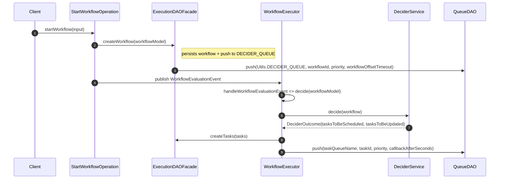
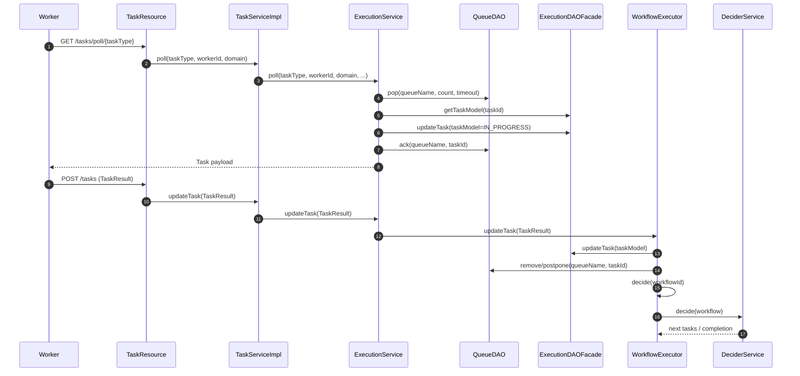
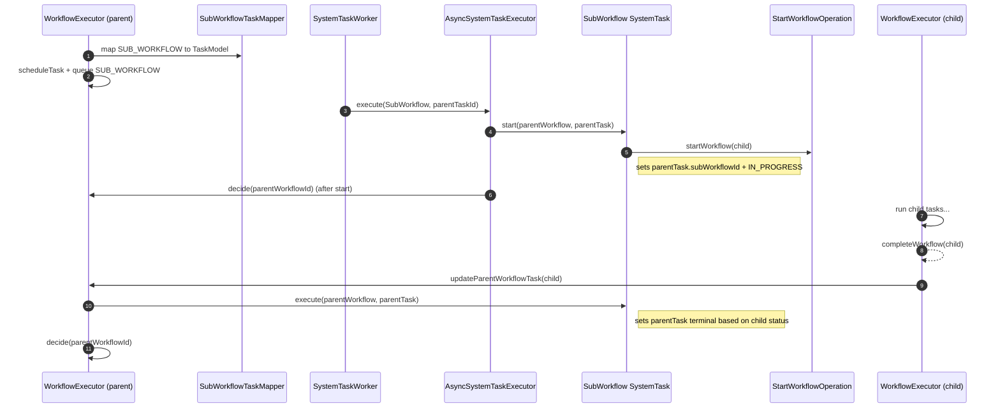
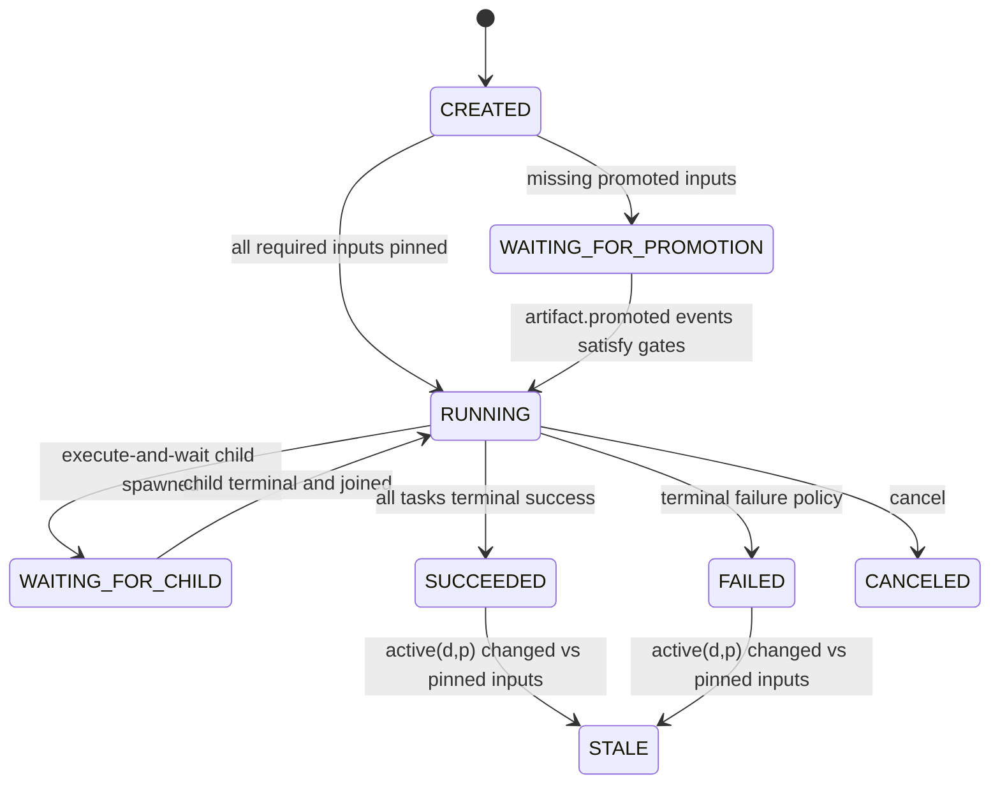

# Netflix Conductor — Architecture & Pattern Extraction for Artifact-First Partitioned Orchestration

> Scope & evidence rule: This document is based only on the provided local checkout snapshot of `Netflix/conductor` (from the uploaded zip). Every factual statement about Conductor is grounded with file paths plus identifiers. Where the snapshot does not contain enough evidence (for example a git commit hash), I explicitly say so.

---

## 1) Repo & Runtime Map

### 1.1 Snapshot identity

- Git commit hash: Unknown from this snapshot (the zip does not include a `.git/` directory or a `git.properties`-style file I can point to).

### 1.2 Module map

Gradle modules included in this snapshot are declared in `settings.gradle` (root). (Evidence: `settings.gradle`, multiple `include '…'` entries.)

- Core engine and data model
  - `conductor-common` — API models and metadata types used across modules (Evidence: `settings.gradle` includes `common`; example: `common/src/main/java/com/netflix/conductor/common/metadata/workflow/WorkflowDef.java`).
  - `conductor-core` — workflow evaluation (decider), scheduling, reconciliation, events runtime (Evidence: `settings.gradle` includes `core`; example: `core/src/main/java/com/netflix/conductor/core/execution/WorkflowExecutor.java`).

- Service front-ends
  - `conductor-server` — Spring Boot application wiring components together (Evidence: `settings.gradle` includes `server`; main class `server/src/main/java/com/netflix/conductor/Conductor.java`).
  - `conductor-rest` — REST controllers (Evidence: `settings.gradle` includes `rest`; example: `rest/src/main/java/com/netflix/conductor/rest/controllers/TaskResource.java`).
  - `conductor-grpc`, `conductor-grpc-server`, `conductor-grpc-client` (Evidence: `settings.gradle` includes `grpc`, `grpc-server`, `grpc-client`).

- Persistence backends (primary datastore plus indexing)
  - `conductor-redis-persistence` — Redis-backed `ExecutionDAO`, `QueueDAO`, etc. (Evidence: `redis-persistence/src/main/java/com/netflix/conductor/redis/dao/RedisExecutionDAO.java` implements `ExecutionDAO`; `redis-persistence/src/main/java/com/netflix/conductor/redis/dao/DynoQueueDAO.java` implements `QueueDAO`).
  - `conductor-cassandra-persistence` — Cassandra-backed metadata and execution DAOs (Evidence: `cassandra-persistence/src/main/java/com/netflix/conductor/cassandra/dao/CassandraExecutionDAO.java` implements `ExecutionDAO`; `cassandra-persistence/src/main/java/com/netflix/conductor/cassandra/dao/CassandraMetadataDAO.java` implements `MetadataDAO`).
  - `conductor-es6-persistence` — Elasticsearch v6 `IndexDAO` (Evidence: `es6-persistence/src/main/java/com/netflix/conductor/es6/dao/index/ElasticSearchDAOV6.java` implements `IndexDAO`).
  - `conductor-core` also contains a `NoopIndexDAO` (Evidence: `core/src/main/java/com/netflix/conductor/core/index/NoopIndexDAO.java` implements `IndexDAO`).

- Locking and limits
  - `conductor-redis-lock` — Redis-backed `Lock` implementation (Evidence: `redis-lock/src/main/java/com/netflix/conductor/redislock/lock/RedisLock.java` implements `com.netflix.conductor.core.sync.Lock`).
  - `conductor-redis-concurrency-limit` — Redis-backed `ConcurrentExecutionLimitDAO` (Evidence: `redis-concurrency-limit/src/main/java/com/netflix/conductor/redis/limit/RedisConcurrentExecutionLimitDAO.java` implements `ConcurrentExecutionLimitDAO`).

- External payload and event integrations
  - `conductor-awss3-storage` — external payload storage backend (module included; exact classes not analyzed here).
  - `conductor-awssqs-event-queue` — SQS-backed event queue provider (module included; exact classes not analyzed here). (Evidence: both included in `settings.gradle`.)

- Task libraries
  - `conductor-http-task`, `conductor-json-jq-task` (Evidence: included in `settings.gradle`).

- Client libraries
  - `conductor-client`, `conductor-client-spring`, `conductor-java-sdk` (Evidence: included in `settings.gradle`).

- Test harness
  - `conductor-test-harness` (Evidence: included in `settings.gradle`).

### 1.3 Main runtime processes and loops

In this snapshot, Conductor’s runtime is a Spring Boot service composed of these key loops:

1) Workflow evaluation (decider) loop

- Entry points:
  - Workflow start publishes a `WorkflowEvaluationEvent`, handled by `WorkflowExecutor.handleWorkflowEvaluationEvent`, which calls `decide(WorkflowModel)` synchronously. (Evidence: `core/src/main/java/com/netflix/conductor/core/operation/StartWorkflowOperation.java` publishes `new WorkflowEvaluationEvent(workflow)`; `core/src/main/java/com/netflix/conductor/core/execution/WorkflowExecutor.java` `@EventListener(WorkflowEvaluationEvent.class)` method `handleWorkflowEvaluationEvent`.)
  - Worker completion calls `WorkflowExecutor.updateTask(…)` which (unless lazy evaluation applies) calls `decide(workflowId)`. (Evidence: `core/src/main/java/com/netflix/conductor/core/execution/WorkflowExecutor.java`, method `updateTask`, final `if (!isLazyEvaluateWorkflow(...)) { decide(workflowId); }`.)

- Core state transition logic:
  - `WorkflowExecutor.decide(WorkflowModel)` orchestrates evaluation, scheduling, and persistence. (Evidence: `core/src/main/java/com/netflix/conductor/core/execution/WorkflowExecutor.java`, method `decide`.)
  - `DeciderService.decide(WorkflowModel)` computes which tasks to schedule or update and whether the workflow completes. (Evidence: `core/src/main/java/com/netflix/conductor/core/execution/DeciderService.java`, method `decide` returning `DeciderOutcome`.)

2) Background reconciliation (sweeper) loop

- A dedicated decider queue of workflow IDs is periodically polled, and each workflow is re-evaluated for timeouts and consistency.
  - Queue name constant: `Utils.DECIDER_QUEUE = "_deciderQueue"`. (Evidence: `core/src/main/java/com/netflix/conductor/core/utils/Utils.java`, constant `DECIDER_QUEUE`.)
  - Poller: `WorkflowReconciler.pollAndSweep()` pops workflow IDs from the decider queue and runs `WorkflowSweeper.sweepAsync`. (Evidence: `core/src/main/java/com/netflix/conductor/core/reconciliation/WorkflowReconciler.java`, `queueDAO.pop(DECIDER_QUEUE, …)` and `workflowSweeper::sweepAsync`.)
  - Sweeper: `WorkflowSweeper.sweep(workflowId)` loads workflow, optionally repairs tasks, then calls `workflowExecutor.decideWithLock(workflow)`, and finally extends the message’s unack timeout based on task state. (Evidence: `core/src/main/java/com/netflix/conductor/core/reconciliation/WorkflowSweeper.java`, methods `sweep` and `unack`, and call to `queueDAO.setUnackTimeout(DECIDER_QUEUE, workflowId, …)`).

3) Async system-task worker loop

- Internal worker that polls queues for system tasks and runs them using `AsyncSystemTaskExecutor`.
  - Poller: `SystemTaskWorker.pollAndExecute(…)` uses `queueDAO.pop(queueName, …)` and executes tasks in a thread pool. (Evidence: `core/src/main/java/com/netflix/conductor/core/execution/tasks/SystemTaskWorker.java`, method `pollAndExecute`.)
  - Executor: `AsyncSystemTaskExecutor.execute(systemTask, taskId)` loads the `TaskModel`, runs `systemTask.start` and `systemTask.execute`, persists, updates queue message via `queueDAO.postpone` or `queueDAO.remove`, then triggers `workflowExecutor.decide(workflowId)` when execution completes. (Evidence: `core/src/main/java/com/netflix/conductor/core/execution/AsyncSystemTaskExecutor.java`, method `execute`.)

4) Event handler loop (external event consumption)

- Event queues are managed and polled; messages trigger actions like start workflow or complete task.
  - Lifecycle manager: `DefaultEventQueueManager` discovers queues and schedules polling. (Evidence: `core/src/main/java/com/netflix/conductor/core/events/DefaultEventQueueManager.java`, `initQueues()` and `startPolling()`).
  - Processor: `DefaultEventProcessor.processMessage` evaluates event handlers and acks or nacks messages. (Evidence: `core/src/main/java/com/netflix/conductor/core/events/DefaultEventProcessor.java`, `processMessage`.)
  - Action execution: `SimpleActionProcessor.execute` dispatches to `start_workflow`, `complete_task`, `fail_task`. (Evidence: `core/src/main/java/com/netflix/conductor/core/events/SimpleActionProcessor.java`, `execute` and helper methods.)

### 1.4 Storage backends and queueing model

Primary workflow and task persistence:

- Defined by `ExecutionDAO` interface. (Evidence: `core/src/main/java/com/netflix/conductor/dao/ExecutionDAO.java`.)
- Implementations present in this snapshot:
  - Redis: `RedisExecutionDAO implements ExecutionDAO`. (Evidence: `redis-persistence/src/main/java/com/netflix/conductor/redis/dao/RedisExecutionDAO.java`.)
  - Cassandra: `CassandraExecutionDAO implements ExecutionDAO`. (Evidence: `cassandra-persistence/src/main/java/com/netflix/conductor/cassandra/dao/CassandraExecutionDAO.java`.)

Metadata persistence (workflow defs, task defs, event handlers):

- `MetadataDAO` interface implementations include Cassandra and Redis. (Evidence: `cassandra-persistence/src/main/java/com/netflix/conductor/cassandra/dao/CassandraMetadataDAO.java`; `redis-persistence/src/main/java/com/netflix/conductor/redis/dao/RedisMetadataDAO.java`.)

Search and indexing:

- `IndexDAO` interface; ES6 and No-op implementations exist. (Evidence: `core/src/main/java/com/netflix/conductor/dao/IndexDAO.java`; `es6-persistence/src/main/java/com/netflix/conductor/es6/dao/index/ElasticSearchDAOV6.java`; `core/src/main/java/com/netflix/conductor/core/index/NoopIndexDAO.java`.)

Queueing model:

- `QueueDAO` is the abstraction used for task queues and the decider queue. (Evidence: `core/src/main/java/com/netflix/conductor/dao/QueueDAO.java`.)
- Redis-backed implementation in this snapshot: `DynoQueueDAO implements QueueDAO` and delegates to `DynoQueue`. (Evidence: `redis-persistence/src/main/java/com/netflix/conductor/redis/dao/DynoQueueDAO.java`.)
- The queue API includes explicit pop, ack, unack timeout operations. (Evidence: `QueueDAO.pop`, `QueueDAO.ack`, `QueueDAO.setUnackTimeout` in `core/src/main/java/com/netflix/conductor/dao/QueueDAO.java`).

### 1.5 Identify the decider and workflow state transition core

Conductor’s state transition core is split into:

- Decision logic: `DeciderService.decide(WorkflowModel) -> DeciderOutcome` (computes next tasks, retries, completion). (Evidence: `core/src/main/java/com/netflix/conductor/core/execution/DeciderService.java`, method `decide` and inner `DeciderOutcome`.)

- Side-effecting orchestration: `WorkflowExecutor.decide(WorkflowModel)` (locks, schedules tasks, writes to DAO, queues messages, recurses). (Evidence: `core/src/main/java/com/netflix/conductor/core/execution/WorkflowExecutor.java`, method `decide`.)

- Serialization of decisions: `WorkflowExecutor.decideWithLock` wraps decide with `ExecutionLockService.acquireLock` and `releaseLock`. (Evidence: `core/src/main/java/com/netflix/conductor/core/execution/WorkflowExecutor.java`, methods `decideWithLock(String)` and `decideWithLock(WorkflowModel)`.)

---

## 2) Formal Model (First Principles)

We model workflow engine = DAG plus persisted state machine plus queue-driven transitions, and map each element to Conductor code.

### 2.1 Workflow definition as a DAG

Define a workflow definition as a typed directed graph:

- G = (V, E), where each node v in V is a typed task (simple task, system or control task, subworkflow, etc.), and edges encode possible next scheduling relations.

Conductor representation:

- Workflow definition container: `WorkflowDef` (workflow name, version, tasks list, timeout policy, variables). (Evidence: `common/src/main/java/com/netflix/conductor/common/metadata/workflow/WorkflowDef.java`.)

- Node type and structural navigation:
  - Nodes are `WorkflowTask` instances, each with `type`, `taskReferenceName`, and nested structure for control-flow tasks. (Evidence: `common/src/main/java/com/netflix/conductor/common/metadata/workflow/WorkflowTask.java`, methods like `getType()`, `getTaskReferenceName()`, and `next(...)`.)
  - `WorkflowDef.getNextTask(String taskReferenceName)` traverses the definition to find the next schedulable task in sequence, delegating to `WorkflowTask.next(...)` for nested structures. (Evidence: `common/src/main/java/com/netflix/conductor/common/metadata/workflow/WorkflowDef.java`, method `getNextTask`.)

Note: workflows are not strictly static DAGs because control tasks (fork/join, do-while, dynamic fork) can generate dynamic scheduling, but the graph structure is still represented via `WorkflowTask` nesting and traversal methods. (Evidence: `WorkflowTask.next(...)` handles `DECISION`, `DO_WHILE`, `FORK_JOIN`, `FORK_JOIN_DYNAMIC`, etc. in `common/src/main/java/com/netflix/conductor/common/metadata/workflow/WorkflowTask.java`.)

### 2.2 Workflow execution state as a persisted state machine

Define execution state as a tuple:

S = (W, T, Σ, Θ, C, A)

Where:
- W is workflow instance metadata (ids, status, times, definition snapshot)
- T is the set of task instances with per-task status and timers
- Σ is workflow variables and accumulated task input/output bindings
- Θ is timers and deadlines (workflow timeout, task timeout, response timeout, poll timeout)
- C is correlation and parent-child linkage
- A is attempt counters (retry count, poll count)

Conductor representation:

- W, Σ, C: `WorkflowModel` holds workflowId, status, create and end times, correlationId, parentWorkflowId and parentWorkflowTaskId, variables, input and output, and a snapshot of `WorkflowDef`. (Evidence: `core/src/main/java/com/netflix/conductor/model/WorkflowModel.java`, fields like `workflowId`, `status`, `correlationId`, `parentWorkflowId`, `variables`, `input`, `output`, `workflowDefinition`.)

- T, Θ, A: `TaskModel` holds per-task state such as status, retryCount, pollCount, start, end, scheduled and update times, callbackAfterSeconds, and derived timeouts. (Evidence: `core/src/main/java/com/netflix/conductor/model/TaskModel.java`, status enum and fields and methods such as `getRetryCount`, `incrementPollCount`, `getCallbackAfterSeconds`, `getUpdateTime`, `getScheduledTime`.)

- Task definition parameters that shape Θ and retry policies:
  - `TaskDef.retryCount`, `TaskDef.retryLogic`, `TaskDef.retryDelaySeconds`, `TaskDef.backoffScaleFactor`, `TaskDef.timeoutSeconds`, `TaskDef.responseTimeoutSeconds`, `TaskDef.pollTimeoutSeconds`, `TaskDef.timeoutPolicy`. (Evidence: `common/src/main/java/com/netflix/conductor/common/metadata/tasks/TaskDef.java`.)

### 2.3 Transition function δ: (S, event) -> S

Define a transition function:

δ: (S, e) -> S'

Events e include:
- worker completion or progress updates
- internal system-task step completion
- timeouts (workflow, task, response, poll)
- retries
- external signals or events leading to task completion or workflow start

Conductor’s δ implementation:

Conductor’s state transition step is triggered by evaluation and implemented as:

- `WorkflowExecutor.decide(WorkflowModel)` (side effects plus persistence) calling
- `DeciderService.decide(WorkflowModel)` (computes schedule, update, complete outcome)

(Evidence: `core/src/main/java/com/netflix/conductor/core/execution/WorkflowExecutor.java`, method `decide`; `core/src/main/java/com/netflix/conductor/core/execution/DeciderService.java`, method `decide`.)

Event-to-transition mapping in Conductor:

1) Worker completion or progress

- Worker reports `TaskResult` via REST `TaskResource.updateTask`, which calls `TaskServiceImpl.updateTask -> ExecutionService.updateTask -> WorkflowExecutor.updateTask`. (Evidence: `rest/src/main/java/com/netflix/conductor/rest/controllers/TaskResource.java`, method `updateTask`; `core/src/main/java/com/netflix/conductor/service/TaskServiceImpl.java`, method `updateTask`; `core/src/main/java/com/netflix/conductor/core/execution/WorkflowExecutor.java`, method `updateTask`.)
- `WorkflowExecutor.updateTask` persists task changes, updates the task queue message (remove or postpone), and then triggers `decide(workflowId)` (unless lazy evaluation applies). (Evidence: `core/src/main/java/com/netflix/conductor/core/execution/WorkflowExecutor.java`, `updateTask` switch on status plus final `decide(workflowId)` call.)

2) Timeouts and stuck detection

- Workflow timeout: `DeciderService.checkWorkflowTimeout` compares elapsed time against `WorkflowDef.getTimeoutSeconds`, enforcing policy. (Evidence: `core/src/main/java/com/netflix/conductor/core/execution/DeciderService.java`, method `checkWorkflowTimeout`.)
- Task timeout: `DeciderService.checkTaskTimeout` uses `TaskDef.getTimeoutSeconds`. (Evidence: same file, method `checkTaskTimeout`.)
- Poll timeout: `DeciderService.checkTaskPollTimeout` uses `TaskDef.getPollTimeoutSeconds` for tasks still `SCHEDULED`. (Evidence: same file, method `checkTaskPollTimeout`.)
- Response timeout: `DeciderService.isResponseTimedOut` checks `TaskModel.updateTime` plus callback against `TaskDef.responseTimeoutSeconds`. (Evidence: same file, method `isResponseTimedOut`.)

These timeout checks run inside `DeciderService.decide` on each evaluation. (Evidence: `DeciderService.decide` calls `checkWorkflowTimeout`, and for each pending task calls `checkTaskTimeout`, `checkTaskPollTimeout`, and `isResponseTimedOut`.)

3) Retry events

- Retry computation: `DeciderService.retry(TaskDef, WorkflowTask, TaskModel, WorkflowModel)` decides whether to schedule a retry based on retry count and computes backoff delay. (Evidence: `core/src/main/java/com/netflix/conductor/core/execution/DeciderService.java`, method `retry` and helper `computeDelayInSeconds`.)

4) External events and signals

- Event handlers consume messages from `ObservableQueue` and execute actions:
  - start workflow (`Action.Type.start_workflow`)
  - complete task (`Action.Type.complete_task`)
  - fail task (`Action.Type.fail_task`)

(Evidence: `common/src/main/java/com/netflix/conductor/common/metadata/events/EventHandler.java`, enum `Action.Type`; `core/src/main/java/com/netflix/conductor/core/events/SimpleActionProcessor.java`, methods `startWorkflow`, `completeTask`, `failTask`.)

### 2.4 Conductor equivalents of key platform concepts

#### Eligibility

Your platform context: eligibility depends on promoted inputs and partition p.

Conductor’s eligibility analogue is: is a task schedulable now given the current executed and terminal tasks and control-flow semantics.

- In `DeciderService.decide`, when a task becomes terminal and is not yet marked executed, Conductor marks it executed and schedules `getNextTask(...)`. (Evidence: `core/src/main/java/com/netflix/conductor/core/execution/DeciderService.java`, in `decide`: the block that sets `pendingTask.setExecuted(true)` and calls `getNextTask`.)

- Task instantiation is done via `DeciderService.getTasksToBeScheduled(...)`, which builds a `TaskMapperContext`, invokes a `TaskMapper` by type, and filters out tasks already present by reference name. (Evidence: `core/src/main/java/com/netflix/conductor/core/execution/DeciderService.java`, method `getTasksToBeScheduled`.)

This corresponds to an eligibility predicate:

eligible(v, S) = depsDone(v, S) and not alreadyScheduled(v, S)

where `alreadyScheduled` is approximated by: a task with the same `referenceTaskName` exists in IN_PROGRESS or terminal. (Evidence: `getTasksToBeScheduled` collects `tasksInWorkflow` from tasks with status IN_PROGRESS or terminal, and filters mapped tasks by reference name.)

#### Idempotency keying

Conductor uses (workflowId, taskRefName, retryCount) as the conceptual idempotency key for task instances.

- DAO contract: `ExecutionDAO.createTasks` documentation states uniqueness on taskReferenceName plus retryCount for a workflow. (Evidence: `core/src/main/java/com/netflix/conductor/dao/ExecutionDAO.java`, Javadoc on `createTasks`.)
- In-memory dedupe during scheduling: `WorkflowExecutor.dedupAndAddTasks` builds a set of `refName_retryCount` from existing workflow tasks, filters new tasks, and then adds them. (Evidence: `core/src/main/java/com/netflix/conductor/core/execution/WorkflowExecutor.java`, method `dedupAndAddTasks`.)
- Redis backend enforces dedupe on create: `RedisExecutionDAO.createTasks` uses `taskKey = refName + "_" + retryCount` in a hash and only creates if the key is absent. (Evidence: `redis-persistence/src/main/java/com/netflix/conductor/redis/dao/RedisExecutionDAO.java`, method `createTasks`.)

Conductor also has idempotency for event handlers:

- `ExecutionDAO.addEventExecution` returns false if event execution already stored. (Evidence: `core/src/main/java/com/netflix/conductor/dao/ExecutionDAO.java`, `addEventExecution`.)
- Redis implementation uses `hsetnx` on a key derived from handler name plus event plus messageId. (Evidence: `redis-persistence/src/main/java/com/netflix/conductor/redis/dao/RedisExecutionDAO.java`, method `addEventExecution`.)

#### Durable waiting

Conductor’s durable waiting is persisted state plus a wake-up mechanism that re-runs δ later. It uses multiple mechanisms:

1) Task queue message delay and postpone

- Tasks are queued with delay via `queueDAO.push(queueName, taskId, priority, callbackAfterSeconds)`. (Evidence: `core/src/main/java/com/netflix/conductor/core/execution/WorkflowExecutor.java`, method `addTaskToQueue(TaskModel)`.)
- When a task is updated to IN_PROGRESS or SCHEDULED, Conductor postpones the queue message using `queueDAO.postpone`. (Evidence: `WorkflowExecutor.updateTask`, switch cases IN_PROGRESS and SCHEDULED call `queueDAO.postpone`.)

2) Async system tasks

- `AsyncSystemTaskExecutor.execute` postpones system task messages when they remain non-terminal, and triggers workflow evaluation when they complete. (Evidence: `core/src/main/java/com/netflix/conductor/core/execution/AsyncSystemTaskExecutor.java`, method `execute`.)

3) Decider queue plus sweeper for wakeups, timeouts, and consistency

- Workflow IDs are placed on the decider queue at workflow creation with an offset. (Evidence: `core/src/main/java/com/netflix/conductor/core/dal/ExecutionDAOFacade.java`, method `createWorkflow` pushes `DECIDER_QUEUE`.)
- `WorkflowReconciler` pops workflow IDs and runs `WorkflowSweeper`, which extends message unack timeouts to schedule next evaluation based on current task statuses. (Evidence: `core/src/main/java/com/netflix/conductor/core/reconciliation/WorkflowReconciler.java`; `core/src/main/java/com/netflix/conductor/core/reconciliation/WorkflowSweeper.java`, method `unack`.)

---

## 3) Execution Semantics (Deep Dive)

### 3.1 Worker polling vs push

Conductor’s external workers are poll-based.

- REST polling endpoint: `TaskResource.poll` and `batchPoll`. (Evidence: `rest/src/main/java/com/netflix/conductor/rest/controllers/TaskResource.java`, methods `poll` and `batchPoll`.)
- Poll implementation:
  - `TaskServiceImpl.batchPoll` calls `ExecutionService.poll(...)`. (Evidence: `core/src/main/java/com/netflix/conductor/service/TaskServiceImpl.java`, method `batchPoll`.)
  - `ExecutionService.poll` pops task IDs from a queue using `queueDAO.pop(...)`, loads `TaskModel`, sets it IN_PROGRESS, persists, and acks. (Evidence: `core/src/main/java/com/netflix/conductor/service/ExecutionService.java`, method `poll`.)

There is no push delivery to external workers in this snapshot’s REST path; workers must poll queues. (Evidence: scheduling uses `WorkflowExecutor.addTaskToQueue` calling `queueDAO.push`, and consumption is via the polling endpoints above.)

### 3.2 Task queues and dispatch model

Queue naming combines task type plus optional routing dimensions.

- `QueueUtils.getQueueName(taskType, domain, isolationGroupId, executionNamespace)` composes domain, execution namespace, and isolation group into the queue name. (Evidence: `core/src/main/java/com/netflix/conductor/core/utils/QueueUtils.java`, method `getQueueName`.)

Scheduling:

- `WorkflowExecutor.scheduleTask(workflow, tasks)` persists tasks via `executionDAOFacade.createTasks(tasks)` and then queues worker tasks and async system tasks via `addTaskToQueue`. (Evidence: `core/src/main/java/com/netflix/conductor/core/execution/WorkflowExecutor.java`, method `scheduleTask`.)

### 3.3 Retry semantics

Conductor computes retries in the decider during evaluation.

- Entry point: `DeciderService.retry(taskDef, workflowTask, task, workflow)` returns an optional retried `TaskModel`. (Evidence: `core/src/main/java/com/netflix/conductor/core/execution/DeciderService.java`, method `retry`.)

Max attempts:

- Conductor uses the retry count defined on the workflow task if present, else falls back to the task definition’s retry count. (Evidence: `DeciderService.retry`, local `expectedRetryCount` assignment.)

Backoff and delay:

- Delay computed by `computeDelayInSeconds(retryDelaySeconds, retryCount, retryLogic, backoffScaleFactor)`:
  - FIXED: retryDelaySeconds
  - EXPONENTIAL_BACKOFF: retryDelaySeconds times 2 to the power retryCount
  - LINEAR_BACKOFF: retryDelaySeconds times backoffScaleFactor times (retryCount plus 1)

(Evidence: `core/src/main/java/com/netflix/conductor/core/execution/DeciderService.java`, method `computeDelayInSeconds`.)

How the retry is materialized:

- If retry is allowed, Conductor constructs a new `TaskModel` via `getTasksToBeScheduled(...)` and sets the new task’s `callbackAfterSeconds` to the computed delay. (Evidence: `DeciderService.retry`, creation of `retriedTask` and call `retriedTask.setCallbackAfterSeconds(delay)`.)
- It marks the previous task retried, sets it to FAILED, and links to the new task id. (Evidence: `DeciderService.retry`: `task.setRetried(true)`, `task.setStatus(FAILED)`, `task.setRetriedTaskId(...)`.)

### 3.4 Timeouts, heartbeats, and stuck-work detection

Workflow timeout:

- Enforced in `DeciderService.checkWorkflowTimeout` using `WorkflowDef.getTimeoutSeconds()` and `WorkflowDef.getTimeoutPolicy()`. (Evidence: `core/src/main/java/com/netflix/conductor/core/execution/DeciderService.java`, `checkWorkflowTimeout`.)

Task execution timeout:

- Enforced in `DeciderService.checkTaskTimeout` using `TaskDef.getTimeoutSeconds()` and `TaskDef.getTimeoutPolicy()` (RETRY, TIME_OUT_WF, ALERT_ONLY). (Evidence: same file, methods `checkTaskTimeout` and `timeoutTaskWithTimeoutPolicy`.)

Poll timeout:

- Enforced in `DeciderService.checkTaskPollTimeout` for tasks remaining SCHEDULED. (Evidence: same file, method `checkTaskPollTimeout`.)

Response timeout and lease extension:

- Response timeout is evaluated in `DeciderService.isResponseTimedOut` for tasks in IN_PROGRESS, based on `now - task.getUpdateTime()` vs response timeout plus callback. (Evidence: `core/src/main/java/com/netflix/conductor/core/execution/DeciderService.java`, method `isResponseTimedOut`.)

- Workers can request lease extension via `TaskResult.isExtendLease`. (Evidence: `common/src/main/java/com/netflix/conductor/common/metadata/tasks/TaskResult.java`, methods `isExtendLease` and `setExtendLease`.)
- `WorkflowExecutor.updateTask` checks the extendLease flag and calls `extendLease(taskResult)` early. (Evidence: `core/src/main/java/com/netflix/conductor/core/execution/WorkflowExecutor.java`, `updateTask`.)
- `WorkflowExecutor.extendLease` delegates to `executionDAOFacade.extendLease(task)`. (Evidence: `core/src/main/java/com/netflix/conductor/core/execution/WorkflowExecutor.java`, method `extendLease`; `core/src/main/java/com/netflix/conductor/core/dal/ExecutionDAOFacade.java`, method `extendLease`.)

Interpretation: Conductor treats worker updates, including lease extensions, as the heartbeat that prevents response timeout.

### 3.5 Exactly-once vs at-least-once assumptions (and duplicate mitigation)

Based on queue ack and unack operations and the absence of transactional coupling between DAO updates and queue operations, Conductor’s execution is best characterized as at-least-once delivery with idempotency and locking for correctness.

Grounding points:

- Queue abstraction supports visibility timeout semantics: `QueueDAO.pop`, `QueueDAO.ack`, `QueueDAO.setUnackTimeout`. (Evidence: `core/src/main/java/com/netflix/conductor/dao/QueueDAO.java`.)
- Workflow evaluation uses a per-workflow execution lock: `WorkflowExecutor.decideWithLock` calls `ExecutionLockService.acquireLock(workflowId)` to serialize transitions. (Evidence: `core/src/main/java/com/netflix/conductor/core/execution/WorkflowExecutor.java`, methods `decideWithLock`.)
- Task scheduling has explicit dedupe:
  - in-memory `WorkflowExecutor.dedupAndAddTasks` (Evidence: `core/src/main/java/com/netflix/conductor/core/execution/WorkflowExecutor.java`, method `dedupAndAddTasks`),
  - plus DAO-level uniqueness contract (Evidence: `core/src/main/java/com/netflix/conductor/dao/ExecutionDAO.java`, `createTasks` Javadoc),
  - and Redis enforcement (Evidence: `redis-persistence/src/main/java/com/netflix/conductor/redis/dao/RedisExecutionDAO.java`, `createTasks`.)

- Duplicate completion mitigation: if a task is already terminal, `WorkflowExecutor.updateTask` removes the queue message and returns. (Evidence: `core/src/main/java/com/netflix/conductor/core/execution/WorkflowExecutor.java`, `updateTask` terminal-state check.)

### 3.6 Mermaid sequence diagrams

(a) Create workflow instance -> schedule tasks

(Evidence anchors: `StartWorkflowOperation.startWorkflow/createAndEvaluate`; `ExecutionDAOFacade.createWorkflow` pushing `DECIDER_QUEUE`; `WorkflowExecutor.handleWorkflowEvaluationEvent`; `WorkflowExecutor.decide`; `DeciderService.decide`; `WorkflowExecutor.scheduleTask` and `addTaskToQueue`.)

(b) Worker polls and completes task -> engine decides next

(Evidence anchors: `TaskResource.poll/updateTask`; `TaskServiceImpl.poll/batchPoll/updateTask`; `ExecutionService.poll`; `WorkflowExecutor.updateTask`; `WorkflowExecutor.decide`; `DeciderService.decide`.)

(c) Subworkflow or child workflow pattern -> join

(Evidence anchors: `SubWorkflowTaskMapper.getMappedTasks`; `SubWorkflow.start/execute`; `AsyncSystemTaskExecutor.execute` asyncComplete removal; `WorkflowExecutor.completeWorkflow` calls `updateParentWorkflowTask`; `WorkflowExecutor.updateParentWorkflowTask` triggers `decide(parent)`.)

---

## 4) Persistence & Consistency

### 4.1 Where workflow state is stored

- Workflow and task state is written through `ExecutionDAOFacade`, which wraps `ExecutionDAO` and `IndexDAO`, and integrates external payload storage handling. (Evidence: `core/src/main/java/com/netflix/conductor/core/dal/ExecutionDAOFacade.java`.)

Key persistence operations:

- Create workflow:
  - `ExecutionDAOFacade.createWorkflow` calls `executionDAO.createWorkflow(workflowModel)` and indexes via `indexDAO.indexWorkflow` or `asyncIndexWorkflow`, and pushes the workflow ID into the decider queue. (Evidence: `ExecutionDAOFacade.createWorkflow`.)

- Update workflow:
  - `ExecutionDAOFacade.updateWorkflow` sets timestamps, externalizes payload, calls `executionDAO.updateWorkflow`, and updates index. (Evidence: `ExecutionDAOFacade.updateWorkflow`.)

- Create tasks:
  - `WorkflowExecutor.scheduleTask` calls `executionDAOFacade.createTasks(tasks)` before queueing. (Evidence: `WorkflowExecutor.scheduleTask`.)

- Update task:
  - `WorkflowExecutor.updateTask` calls `executionDAOFacade.updateTask(task)` (after queue operations) and writes task exec logs via `executionDAOFacade.addTaskExecLog`. (Evidence: `WorkflowExecutor.updateTask` and `ExecutionDAOFacade.addTaskExecLog`.)

### 4.2 Atomicity and concurrency control

Primary concurrency mechanism: a workflow-level lock

- `WorkflowExecutor.decideWithLock` serializes evaluation per workflowId via `ExecutionLockService.acquireLock` and `releaseLock`. (Evidence: `core/src/main/java/com/netflix/conductor/core/execution/WorkflowExecutor.java`, `decideWithLock`.)
- Workflow creation also holds the lock across `executionDAOFacade.createWorkflow` and publication of the evaluation event. (Evidence: `core/src/main/java/com/netflix/conductor/core/operation/StartWorkflowOperation.java`, method `createAndEvaluate`.)

`ExecutionLockService` delegates to `Lock` implementations and has an enable flag. (Evidence: `core/src/main/java/com/netflix/conductor/service/ExecutionLockService.java`, method `acquireLock`, property check `properties.isWorkflowExecutionLockEnabled()`.)

Redis provides a concrete lock:

- `RedisLock.acquireLock` uses Redis setnx with an expiration and stores a lockId token per resource. (Evidence: `redis-lock/src/main/java/com/netflix/conductor/redislock/lock/RedisLock.java`, methods `acquireLock` and `releaseLock`.)

No optimistic version field observed on workflow and task models in this snapshot

- `WorkflowModel` fields include ids, status, timestamps, input and output, etc., but there is no explicit integer version field used for optimistic concurrency control in this class. (Evidence: `core/src/main/java/com/netflix/conductor/model/WorkflowModel.java`, field list.)

So correctness for state transitions is primarily lock-based, not version-based.

### 4.3 Consistency between datastore and queues

Conductor explicitly acknowledges non-atomic coupling between DB writes and queue publishes.

- In `WorkflowExecutor.scheduleTask`, after persisting tasks, Conductor calls `addTaskToQueue(tasksToBeQueued)` in a try catch and intentionally ignores failures, stating that `WorkflowRepairService` will republish messages. (Evidence: `core/src/main/java/com/netflix/conductor/core/execution/WorkflowExecutor.java`, `scheduleTask` comment and try catch.)

- `WorkflowRepairService.verifyAndRepairTask` checks whether an expected queue message exists using `queueDAO.containsMessage(queueName, taskId)` and republishes if missing. (Evidence: `core/src/main/java/com/netflix/conductor/core/reconciliation/WorkflowRepairService.java`, method `verifyAndRepairTask`.)

This is an explicit eventual consistency repair design for the DB and queue gap.

### 4.4 What is stored for audit and history and how it’s queried

In this snapshot, Conductor stores:

- Workflow record including tasks list, at least within the `WorkflowModel` persisted by `ExecutionDAO`. (Evidence: `WorkflowModel` contains `List<TaskModel> tasks`; `ExecutionDAOFacade.getWorkflowModel` loads workflow.)

- Task execution logs: `TaskExecLog` objects can be indexed via `ExecutionDAOFacade.addTaskExecLog` with size limits. (Evidence: `core/src/main/java/com/netflix/conductor/core/dal/ExecutionDAOFacade.java`, method `addTaskExecLog`.)

- Event executions: `EventExecution` records are stored to dedupe and track event handler processing. (Evidence: `common/src/main/java/com/netflix/conductor/common/metadata/events/EventExecution.java`; storage contract `ExecutionDAO.addEventExecution/updateEventExecution/removeEventExecution` in `core/src/main/java/com/netflix/conductor/dao/ExecutionDAO.java`.)

Query surfaces:

- Search APIs are backed by `IndexDAO`:
  - `ExecutionDAOFacade.searchWorkflows`, `searchTasks`, `searchWorkflowSummary`, `searchTaskSummary`. (Evidence: `core/src/main/java/com/netflix/conductor/core/dal/ExecutionDAOFacade.java`, these methods.)

- Correlation id searches fall back to index when the `ExecutionDAO` cannot search across workflows. (Evidence: `ExecutionDAOFacade.getWorkflowsByCorrelationId`.)

Gap vs audit-grade event log: Conductor’s stored state is oriented around current state plus summary indexing, not an append-only lineage or event ledger. (Evidence: primary types used are `WorkflowModel`, `TaskModel`, `TaskExecLog`, `EventExecution`, and indexing of `WorkflowSummary` and `TaskSummary` in `ExecutionDAOFacade.updateWorkflow`.)

---

## 5) Eventing / External Events

### 5.1 Event tasks inside workflows

Conductor includes a system task type EVENT that publishes a message to an external event queue.

- Task mapper: `EventTaskMapper` maps a `WorkflowTask` of type EVENT to a `TaskModel` with `taskType` set to `EVENT` (string "EVENT"). (Evidence: `core/src/main/java/com/netflix/conductor/core/execution/mapper/EventTaskMapper.java`, `getTaskType()` and `getMappedTasks`.)
- System task implementation: `Event` publishes to an `ObservableQueue` derived from sink input and sets task status accordingly. (Evidence: `core/src/main/java/com/netflix/conductor/core/execution/tasks/Event.java`, method `execute` and helper `computeQueueName`.)
- Queue provider resolution: `EventQueues.getQueue(eventType)` resolves a provider based on a `type:uri` prefix. (Evidence: `core/src/main/java/com/netflix/conductor/core/events/EventQueues.java`, method `getQueue`.)

### 5.2 External event handlers

Conductor’s event handler subsystem consumes external events and performs actions.

- Event handler definition: `EventHandler` with event, condition, and a list of actions (start workflow, complete task, fail task). (Evidence: `common/src/main/java/com/netflix/conductor/common/metadata/events/EventHandler.java`, fields and nested `Action.Type`.)

- Queue polling: `DefaultEventQueueManager.startPolling()` schedules periodic polls of `ObservableQueue.observe()` for each queue discovered. (Evidence: `core/src/main/java/com/netflix/conductor/core/events/DefaultEventQueueManager.java`, methods `startPolling` and `pollEventQueues`.)

- Message processing and idempotency:
  - `DefaultEventProcessor.processMessage` creates an `EventExecution` per action, stores it with `executionService.addEventExecution`, and skips if already stored. It then executes actions, updates event execution status, and acks or nacks the underlying queue message. (Evidence: `core/src/main/java/com/netflix/conductor/core/events/DefaultEventProcessor.java`, method `processMessage` plus calls to `executionService.addEventExecution`, `executionService.updateEventExecution`, `queue.ack`, `queue.nack`, `queue.rePublishIfNoAck()`.)

- Action execution:
  - `SimpleActionProcessor.startWorkflow` calls `startWorkflowOperation.execute` with name, version, correlationId, input. (Evidence: `core/src/main/java/com/netflix/conductor/core/events/SimpleActionProcessor.java`, method `startWorkflow`.)
  - `SimpleActionProcessor.completeTask` looks up a running task by refName in a workflow and calls `workflowExecutor.updateTask`. (Evidence: `SimpleActionProcessor.completeTask`.)

### 5.3 Mapping to our artifact.promoted(d,p,v) event

Your platform context: event-driven triggers from `artifact.promoted(d,p,v)`.

A Conductor-like hook point is the event-handler pipeline:

- Provide an event queue provider for your artifact registry event log, analogous to `EventQueueProvider` resolved by `EventQueues.getQueue(type:uri)`, then register event handlers whose event matches your scheme. (Evidence: `core/src/main/java/com/netflix/conductor/core/events/EventQueues.java`, method `getQueue` provider lookup by prefix; `common/.../EventHandler.java` event field; `DefaultEventQueueManager` polling queues.)

- Use `EventHandler.Action.Type.start_workflow` to start a partitioned pipeline run when an artifact promotion occurs. (Evidence: `EventHandler.Action.Type.start_workflow`; `SimpleActionProcessor.startWorkflow`.)

- Or use `complete_task` and `fail_task` actions to implement promotion gates within an existing run by completing or failing a gate task when `artifact.promoted` is observed. (Evidence: `EventHandler.Action.Type.complete_task`; `SimpleActionProcessor.completeTask`.)

Key reusable idempotency: Conductor’s event handler stores `EventExecution` keyed by handler plus event plus message id, skipping duplicates. (Evidence: `DefaultEventProcessor.processMessage` calls `executionService.addEventExecution` and checks return; `RedisExecutionDAO.addEventExecution` uses `hsetnx`.)

---

## 6) Mapping to Our Platform (Table)

Your platform invariants:

- Partitioned recurring pipelines with partition_key p.
- Artifact immutability and registry pointer active(d,p) -> v with promotion gates.
- Eligibility depends on promoted inputs; runs are immutable; stale detection if inputs change post-run.
- Support enqueue-child vs execute-and-wait child semantics, with guardrails (depth, spawn budget, cycle).
- Event log and lineage required; audit-grade.
- Event-driven triggers from artifact.promoted.

| Our invariant | Conductor concept | Code evidence | Reuse | Adaptation | Risks |
|---|---|---|---|---|---|
| partition_key p | correlationId groups workflows; workflowId unique run id | `WorkflowModel.correlationId` (`core/.../WorkflowModel.java`); `EventHandler.StartWorkflow.correlationId` (`common/.../EventHandler.java`); `ExecutionDAOFacade.getWorkflowsByCorrelationId` (`core/.../ExecutionDAOFacade.java`) | Use correlationId-like grouping for (d,p) and stable run ids | Define deterministic mapping correlationId = f(d,p) and runId = f(d,p,run_seq) | No uniqueness enforcement; multiple workflows per correlationId are allowed (`ExecutionDAOFacade.getWorkflowsByCorrelationId` returns list) |
| artifact version pinning at run start | snapshot metadata into run record | `StartWorkflowOperation` sets `workflow.setWorkflowDefinition(...)` (`core/.../StartWorkflowOperation.java`); `MetadataMapperService` comment about immutable definitions (`core/.../MetadataMapperService.java`) | Snapshot input manifest into Run record | Extend snapshot to include artifact pins (d,p)->v for all inputs | Conductor chooses latest workflow def when version omitted (`MetadataMapperService.lookupForWorkflowDefinition`) |
| stale detection (active pointer changes after run) | not present | No artifact pointer fields in `WorkflowModel` (`core/.../WorkflowModel.java`) | None | Add explicit comparison between pinned manifest and active(d,p) -> v; emit stale events | Requires new data and event log primitives |
| child execution semantics | SUB_WORKFLOW start child and update parent on completion | `SubWorkflowTaskMapper` (`core/.../SubWorkflowTaskMapper.java`); `SubWorkflow` (`core/.../SubWorkflow.java`); `WorkflowExecutor.updateParentWorkflowTask` (`core/.../WorkflowExecutor.java`) | Strong reuse for execute-and-wait semantics | Add also enqueue-child mode; store parent-child linkage; define join semantics | Need guardrails; Conductor core loop shows no spawn budget checks |
| guardrails (spawn budgets, depth, cycle) | concurrency limits + throttling only | `ConcurrentExecutionLimitDAO` (`core/.../ConcurrentExecutionLimitDAO.java`); Redis impl (`redis-concurrency-limit/.../RedisConcurrentExecutionLimitDAO.java`); `ExecutionConfig` semaphores (`core/.../ExecutionConfig.java`) | Reuse throttling and concurrency limit patterns | Add per-run budgets and cycle detection inside δ | Without budgets, dynamic forks and subworkflows can explode |
| event log and lineage audit-grade | current-state persistence + indexing + task logs + event execution | `ExecutionDAOFacade.updateWorkflow` indexes `WorkflowSummary` and `TaskSummary` (`core/.../ExecutionDAOFacade.java`); `TaskExecLog` (`ExecutionDAOFacade.addTaskExecLog`); `EventExecution` (`common/.../EventExecution.java`) | Reuse event-execution dedupe + task logs as components | Implement append-only event log; derive lineage views | Conductor data model is mutation-heavy; lineage requires new architecture |

---

## 7) What to Steal

At least 10 patterns with code anchors:

1) Separate decision from effects
- Evidence: `core/.../DeciderService.java#decide` versus `core/.../WorkflowExecutor.java#decide`.

2) Per-run execution lock
- Evidence: `WorkflowExecutor.decideWithLock` (`core/.../WorkflowExecutor.java`); `ExecutionLockService` (`core/.../ExecutionLockService.java`); `RedisLock` (`redis-lock/.../RedisLock.java`).

3) Idempotent task identity refName plus retryCount
- Evidence: `ExecutionDAO.createTasks` Javadoc (`core/.../ExecutionDAO.java`); `WorkflowExecutor.dedupAndAddTasks` (`core/.../WorkflowExecutor.java`); `RedisExecutionDAO.createTasks` (`redis-persistence/.../RedisExecutionDAO.java`).

4) Queue abstraction with explicit ack and unack semantics
- Evidence: `QueueDAO` (`core/.../QueueDAO.java`).

5) Repair loop for DB and queue mismatches
- Evidence: `WorkflowExecutor.scheduleTask` try catch and comment (`core/.../WorkflowExecutor.java`); `WorkflowRepairService.verifyAndRepairTask` (`core/.../WorkflowRepairService.java`).

6) System tasks run on internal worker plane
- Evidence: `SystemTaskWorker` (`core/.../SystemTaskWorker.java`); `AsyncSystemTaskExecutor` (`core/.../AsyncSystemTaskExecutor.java`).

7) Async-complete system task abstraction
- Evidence: `WorkflowSystemTask.isAsyncComplete` (`core/.../WorkflowSystemTask.java`).

8) Execute-and-wait child runs
- Evidence: `SubWorkflow.start` sets `subWorkflowId` (`core/.../SubWorkflow.java`); `WorkflowExecutor.updateParentWorkflowTask` (`core/.../WorkflowExecutor.java`).

9) Event handler pipeline and dedupe
- Evidence: `DefaultEventProcessor.processMessage` (`core/.../DefaultEventProcessor.java`); `ExecutionService.addEventExecution` (`core/.../ExecutionService.java`); `RedisExecutionDAO.addEventExecution` (`redis-persistence/.../RedisExecutionDAO.java`).

10) Lazy evaluation to reduce decider churn
- Evidence: `WorkflowExecutor.isLazyEvaluateWorkflow` and its use in `updateTask` (`core/.../WorkflowExecutor.java`).

11) Queue routing dimensions
- Evidence: `QueueUtils.getQueueName` (`core/.../QueueUtils.java`).

12) Payload externalization with size thresholds
- Evidence: `ConductorProperties` payload threshold fields (`core/.../ConductorProperties.java`); `ExecutionDAOFacade.externalizeWorkflowData/externalizeTaskData` (`core/.../ExecutionDAOFacade.java`).

---

## 8) What NOT to Steal / Mismatches

1) Latest workflow definition when version is omitted
- Evidence: `MetadataMapperService.lookupForWorkflowDefinition` uses `lookupLatestWorkflowDefinition` when version is null (`core/.../MetadataMapperService.java`).
- Mismatch: artifact immutability requires pinning.

2) Mutation-based state as primary source of truth
- Evidence: `WorkflowExecutor.updateTask` mutates task status and output data and writes back (`core/.../WorkflowExecutor.java`).
- Mismatch: audit-first event log requires append-only transitions.

3) No native stale detection
- Evidence: no artifact pointer or version fields on `WorkflowModel` (`core/.../WorkflowModel.java`).

4) No explicit spawn budgets or cycle prevention in decider
- Evidence: `WorkflowExecutor.decide` and `DeciderService.decide` do not contain such checks (`core/.../WorkflowExecutor.java`, `core/.../DeciderService.java`).

---

## 9) Actionable Output

### 9.1 ADRs to write

1) ADR: decider δ separation from execution side effects
- Inspired by: `DeciderService.decide` and `WorkflowExecutor.decide`.

2) ADR: concurrency model for state transitions
- Inspired by: `ExecutionLockService` and `RedisLock`.

3) ADR: idempotency key scheme
- Inspired by: refName plus retryCount in `ExecutionDAO.createTasks` and `WorkflowExecutor.dedupAndAddTasks`.

4) ADR: queue publish consistency (repair vs transactional outbox)
- Inspired by: `WorkflowRepairService.verifyAndRepairTask` and `WorkflowExecutor.scheduleTask`.

5) ADR: child run semantics and parent join
- Inspired by: `SubWorkflow` and `WorkflowExecutor.updateParentWorkflowTask`.

6) ADR: promotion gates as first-class state
- Inspired by: event handler `complete_task` and `SimpleActionProcessor.completeTask`.

7) ADR: audit-grade event log and lineage
- Conductor does not implement this natively; define ours explicitly.

### 9.2 Minimal Conductor-inspired execution plane sketch for our product

This section is a proposal, explicitly tailored to your platform context.

(A) Data model

- Run
  - key: (dag_id d, partition_key p, run_id r)
  - pinned_inputs: map of artifact to version v (immutable)
  - status: CREATED, WAITING_FOR_PROMOTION, RUNNING, WAITING_FOR_CHILD, SUCCEEDED, FAILED, CANCELED, STALE

- TaskRun
  - key: (run_id r, task_ref_name, attempt)
  - status: SCHEDULED, IN_PROGRESS, COMPLETED, FAILED, TIMED_OUT

- EventLog (append-only)
  - per run_id or per (d,p)
  - events: RunCreated, InputsPinned, TaskScheduled, TaskLeased, TaskHeartbeat, TaskCompleted, TaskFailed, PromotionObserved, ChildRunSpawned, ChildRunCompleted, RunStaleDetected

- Lineage views
  - derived from EventLog: output artifact version produced by run, run depends-on pinned inputs

(B) Idempotency keys

- task schedule: (run_id, task_ref_name, attempt)
- child spawn:
  - enqueue-child: (parent_run_id, parent_task_ref_name, spawn_index)
  - execute-and-wait: same, but parent enters WAITING_FOR_CHILD(child_run_id)
- promotion processing: (artifact_id d, partition_key p, version v, gate_id)
  - store an EventExecution-like record per gate to dedupe, inspired by Conductor `EventExecution` and `ExecutionDAO.addEventExecution`.

(C) Run lifecycle state machine

(D) Execution plane mechanics inspired by Conductor

- Evaluation queue: analogous to Conductor decider queue (`Utils.DECIDER_QUEUE`), but partitioned. Trigger evaluation on task completion, promotion events, and periodic sweeps.
- Worker plane: poll-based, like Conductor `ExecutionService.poll` and queue-based dispatch.
- Internal system tasks: model promotion gates and child joins as internal tasks executed by an internal worker plane, like `SystemTaskWorker` and `AsyncSystemTaskExecutor`.
- Repair loop: adopt Conductor-style repair (`WorkflowRepairService`) or replace with transactional outbox; decide via ADR.

---

## Focus questions (answered with code grounding)

### How does Conductor guarantee durable waiting and resumption?

- Persisted state: workflow and task state are persisted via `ExecutionDAOFacade` and `ExecutionDAO`. (Evidence: `ExecutionDAOFacade.createWorkflow/updateWorkflow/updateTask`.)
- Delayed queue messages: tasks are queued with `callbackAfterSeconds` and can be postponed (`queueDAO.push` and `queueDAO.postpone`). (Evidence: `WorkflowExecutor.addTaskToQueue`; `WorkflowExecutor.updateTask` postpone path.)
- Reconciliation loop: workflows are periodically re-evaluated via decider queue plus sweeper, which extends unack timeouts based on current task statuses. (Evidence: `Utils.DECIDER_QUEUE`; `WorkflowReconciler.pollAndSweep`; `WorkflowSweeper.unack`.)

### What are the exact failure and retry semantics, and what does it assume about worker behavior?

- Retry policy and delay computation: `DeciderService.retry` and `computeDelayInSeconds`. (Evidence: `core/.../DeciderService.java`.)
- Timeout policies for tasks: ALERT_ONLY, RETRY, TIME_OUT_WF enforced in `timeoutTaskWithTimeoutPolicy`. (Evidence: `core/.../DeciderService.java`.)
- Worker behavior: workers poll tasks via REST and report `TaskResult` updates; Conductor updates state and triggers `decide()`. (Evidence: `TaskResource.poll/updateTask`; `ExecutionService.poll`; `WorkflowExecutor.updateTask`.)

### How does it represent subworkflow and child workflows, and what should we copy to implement execute-and-wait child runs safely?

- Parent task stores subWorkflowId. (Evidence: `SubWorkflow.start` sets `task.setSubWorkflowId(...)` in `core/.../SubWorkflow.java`.)
- Child workflow stores parentWorkflowId and parentWorkflowTaskId. (Evidence: `StartWorkflowOperation.startWorkflow` sets these; and `WorkflowModel` includes these fields.)
- Child completion updates parent via `WorkflowExecutor.updateParentWorkflowTask` and triggers parent evaluation. (Evidence: `WorkflowExecutor.completeWorkflow` and `WorkflowExecutor.updateParentWorkflowTask`.)

### How is the system protected from runaway workflows, and what guardrails should we emulate?

Proven from this snapshot:

- Task-level concurrency limits via `ConcurrentExecutionLimitDAO` and Redis implementation. (Evidence: `core/.../ConcurrentExecutionLimitDAO.java`; `redis-concurrency-limit/.../RedisConcurrentExecutionLimitDAO.java`.)
- Internal execution-plane throttling for system tasks via semaphores and thread pool sizing in `ExecutionConfig` used by `SystemTaskWorker`. (Evidence: `core/.../ExecutionConfig.java`; `core/.../SystemTaskWorker.java`.)
- Payload size thresholds and max limits in `ConductorProperties`. (Evidence: `core/.../ConductorProperties.java`.)

Not observed in core scheduling and evaluation:

- No explicit run-level spawn budgets, recursion depth limits, or cycle detection in `WorkflowExecutor.decide` and `DeciderService.decide`. (Evidence: these methods lack such checks.)

Recommended guardrails for our platform:

- Keep Conductor’s concurrency limiting and repair loops.
- Add run-level budgets (max tasks scheduled, max children spawned) and enforce them inside δ.

