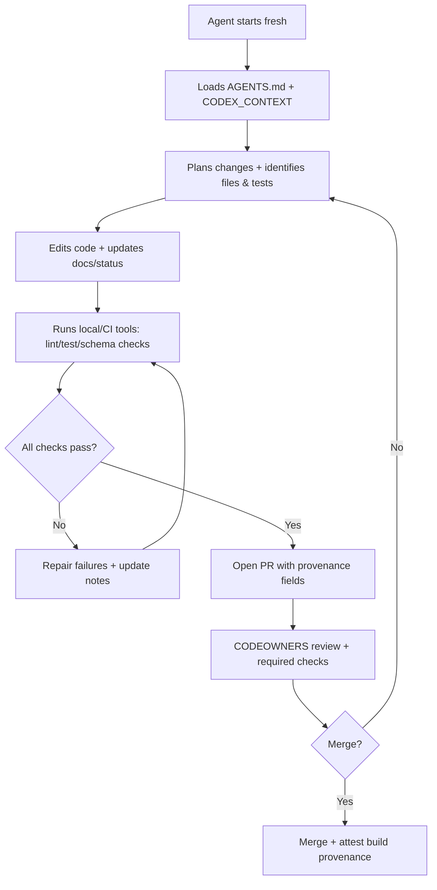

# Do deep research on designing a GitHub repo and development workflow for safe, re-entrant LLM coding sessions

## Table of contents
- Executive summary
- Assumptions and design objectives
- Repository context artifacts that enable re-entry
- Development workflow and CI guardrails for LLM contributions
- Runtime architecture for safe LLM execution and provenance
- Risk matrix and mitigations
- Template pack
- Sources

## Executive summary

Repeated “fresh-session” coding with OpenAI Codex (or similar LLM agents) is productive only if you **externalize state** into the repository in a form that is: (a) discoverable automatically, (b) unambiguous, (c) machine-validated, and (d) safe under least privilege. OpenAI explicitly supports repository-native guidance via `AGENTS.md` (loaded before work), project scoped configuration via `.codex/config.toml` (loaded when the project is trusted), and sandbox/approval controls to constrain what the agent can do. citeturn5view1turn10view0turn6view0

The practical repo strategy is to treat “LLM memory” as a **Context Plane** inside the repo: versioned schemas, ADRs, workflow contracts, event envelopes, dataset key registries, fixtures/golden outputs, and policy bundles that encode what “correct” means. This aligns with OpenAI’s own framing that long-horizon agent quality depends on the agent loop (plan → edit → run tools → observe → repair → **update docs/status** → repeat) and on “externalized state (repo, files, docs, …).” citeturn6view2turn10view3

Safety and repeatability come from a second layer: **workflow guardrails** (GitHub protections, CODEOWNERS, required status checks, secret scanning push protection, dependency review, provenance attestations) plus runtime constraints (sandboxed execution, policy-as-code, model gateway, tenant scoping, rate limits, ephemeral credentials). GitHub documents the relevant controls (protected branches + required status checks; CODEOWNERS-required reviews; secret scanning push protection; dependency review; artifact attestations for build provenance; OIDC for short-lived deployment credentials). citeturn2search1turn2search0turn2search2turn3search1turn3search2turn3search0

For your specific platform, your Stage 1/2 artifacts already define the “formal objects” an agent must constantly respect (tenant + domain scope, dataset registry pointers, event envelope fields, pinned runs, and “complete timeline + strong linking”). Those should be **front-and-center** in the repo context plane, because they are exactly the kind of invariants that a stateless agent will otherwise violate accidentally. fileciteturn0file1fileciteturn0file2fileciteturn0file0

## Assumptions and design objectives

### Explicit assumptions
These assumptions drive what must be stored in-repo vs enforced by platform policy.

- **LLM sessions are re-entrant and stateless**: each invocation starts with no memory beyond what it can read from the repo and what the harness supplies. (Design objective; aligns with Codex’s “each task processed independently in an isolated environment” and the emphasis on repo-provided instructions and evidence.) citeturn10view3turn6view2  
- **The agent can read the repo and propose edits; it may run tests/builds depending on sandbox/approvals** (Codex can read/edit files and run commands; approvals and sandboxing control what happens). citeturn6view1turn6view0turn5view2  
- **The agent’s write actions are mediated by PRs + mandatory review** (OpenAI stresses manual review before integration; GitHub supports required reviews and protected branches). citeturn10view3turn2search1turn2search0  
- **You may use Codex locally, in cloud tasks, or via non-interactive/CI modes** (Codex CLI, `codex exec` non-interactive mode, and Codex GitHub Action exist). citeturn12search2turn12search0turn6view1  
- **You need tenant/domain and audit-grade invariants** because your MVP contract requires durable timeline + strong linking, tenant + domain hard partitions, and safe automation. fileciteturn0file2fileciteturn0file1  

### Design objectives
- **Deterministic context loading**: the agent should always know where to look first for authoritative context (even if the repo is large). `AGENTS.md` is ideal for this because Codex loads it before doing any work and supports layered overrides. citeturn5view1turn10view3  
- **Context is machine-checkable**: anything critical (event schemas, API contracts, workflow contracts, dataset keys, policy allowlists) should have a schema and validation step in CI. (Experience-based inference; supported by the general “schema-first” and supply-chain verification posture in SLSA and GitHub provenance checks.) citeturn1search0turn3search2  
- **Safety is enforced at multiple layers**: repo artifacts guide behavior; GitHub policies gate merges; runtime sandbox/policy gates tool execution. This mirrors OpenAI guidance that sandboxing and approvals constrain Codex actions, and GitHub’s documented controls enforce review + checks. citeturn6view0turn5view2turn2search1  

## Repository context artifacts that enable re-entry

### Context-plane layout
A practical repo design is to explicitly create a “LLM Context Plane” alongside your code. The key is to make **authoritative context** easy to locate and small enough to be loaded early, while keeping the full detail elsewhere.

Recommended top-level structure (experience-based inference, but aligned to Codex’s `AGENTS.md` discovery and `.codex` project config support): citeturn5view1turn10view0

```text
/
  AGENTS.md
  LLM_RUNBOOK.md
  codex/
    CODEX_CONTEXT.yaml
    POLICY_ALLOWLIST.yaml
    PROMPT_TEMPLATE.md
  .codex/
    config.toml            # project overrides (trusted projects only)
  docs/
    adr/
    workflows/
    architecture/
    security/
    ops/
  schemas/
    events/
    api/
    artifacts/
    policy/
  fixtures/
    workflows/
      payroll/
        inputs/
        expected_outputs/
```

#### Why this works with Codex specifically
- Codex reads `AGENTS.md` before doing any work and supports an instruction chain from repo root downward, with size limits and fallbacks. citeturn5view1  
- Codex supports project-scoped configuration in `.codex/config.toml` that is only loaded if the project is trusted. citeturn10view0turn5view0  
- Codex supports explicit approval policies and sandbox modes, and rules that control command execution outside the sandbox; enterprise admins can enforce requirements via `requirements.toml`. citeturn6view0turn8view0turn8view1  

### Required context items and where they should live

The items below map directly to what a re-entrant LLM needs to “pick up where it left off” without hallucinating interfaces or violating invariants.

#### Workflow contracts
**What:** A versioned contract per workflow (inputs/outputs, approvals, flags, required events, example fixtures).  
**Format:** YAML (human-readable, diff-friendly).  
**Location:** `docs/workflows/<workflow>/vN/WORKFLOW_CONTRACT.yaml` and `fixtures/workflows/<workflow>/...`  
**Rationale:** Your Stage 2 PRD defines workflow contracts as testable and centered on official inputs/outputs, sign-off roles, and evidence requirements. fileciteturn0file2

#### Event envelope + event schemas
**What:** A standardized envelope plus per-event-type payload schemas.  
**Format:** JSON Schema (current draft 2020‑12) for machine validation. citeturn4search2turn4search6  
**Location:** `schemas/events/envelope.json` and `schemas/events/<event_type>.schema.json`  
**Rationale:** Your Stage 1 appendix already defines the required envelope fields (tenant_id, correlation, artifact_refs, etc.) and Stage 2 NFR-A1 requires field completeness and schema validation. fileciteturn0file1fileciteturn0file2  
**Interoperability note:** If you adopt CloudEvents as a base envelope, store a mapping doc and enforce the required CloudEvents attributes (id/source/type/specversion). citeturn4search0turn4search4

#### API contracts
**What:** OpenAPI specs and/or RPC schemas for every externally callable API boundary.  
**Format:** OpenAPI 3.1 (aligns with JSON Schema 2020‑12). citeturn4search5turn4search9  
**Location:** `schemas/api/openapi.yaml` (or per-service under `schemas/api/<service>/openapi.yaml`)  
**Rationale:** Keeps an LLM from guessing endpoints and payload shapes; it also enables automated contract testing (experience-based inference, supported by OpenAPI’s goal of being a standard interface description). citeturn4search5

#### Dataset keys and artifact metadata schemas
**What:** Authoritative registry of dataset keys and their artifact-type constraints; artifact metadata schema; promotion semantics.  
**Format:** YAML for the dataset registry + JSON Schema for artifact metadata.  
**Location:** `schemas/artifacts/dataset_keys.yaml` and `schemas/artifacts/artifact_metadata.schema.json`  
**Rationale:** Your Stage 1 formal model uses dataset keys, partition keys, and registry pointers (active(d,p)->v); Stage 2 domain model makes dataset keys first-class. fileciteturn0file1fileciteturn0file2

#### Tenant/domain model and authorization vocabulary
**What:** explicit definitions and examples of `tenant_id`, `domain_id` semantics plus “tenant-global vs domain-scoped objects,” and the minimum permission vocabulary.  
**Format:** Markdown + YAML/JSON for permissions.  
**Location:** `docs/architecture/scope_model.md`, `schemas/policy/permissions.yaml`  
**Rationale:** Stage 2 makes domain partition enforcement (cross-domain denial) a core acceptance criterion; a re-entrant LLM must not “accidentally” bypass scoping. fileciteturn0file2

#### ADRs and decision log
**What:** architecture decision records with status, consequences, and links to code + tests.  
**Format:** Markdown.  
**Location:** `docs/adr/ADR-XXXX-*.md` + `docs/adr/README.md` index.  
**Rationale:** Safe evolution and governance: NIST AI RMF emphasizes governance/lifecycle risk management; OpenAI’s governed agents guidance stresses “policies travel with the code.” citeturn1search1turn11view3  
**Project-specific:** Your Stage 2 guardrails explicitly require pinned runs + breaking-change taxonomy + pre-deploy checks; ADRs are where an LLM should confirm “what is the rule here?” before altering semantics. fileciteturn0file2

#### Fixtures, example inputs/outputs, and golden traces
**What:** small, sanitized fixtures + expected outputs + “golden event timelines” for the reference workflow (payroll).  
**Format:** CSV/JSON for inputs; JSON for expected events; plus minimal spreadsheets if absolutely necessary (experience-based inference: prefer generating spreadsheets in tests rather than committing large binaries).  
**Location:** `fixtures/workflows/payroll/inputs/*` and `fixtures/workflows/payroll/expected_outputs/*`  
**Rationale:** OpenAI notes Codex provides verifiable evidence via logs/test outputs and performs best with reliable testing setups; the Codex long-horizon loop explicitly includes running tests and updating docs/status. citeturn10view3turn6view2

### Metadata conventions for re-entry
Stateless agents need stable “anchors.” These conventions make context unambiguous and diff-friendly.

- **Every context artifact has explicit version + last_updated** (ISO 8601) (experience-based inference).  
- **Provenance headers** in YAML/JSON: `owner`, `reviewers`, `source_of_truth`, `effective_date`, `supersedes`. (Experience-based inference; aligned with the discipline of explicit decision logs in governed systems.) citeturn11view3turn1search1  
- **Schema evolution discipline**: `schema_version` and `$schema` URLs for JSON Schema Draft 2020-12. citeturn4search6turn4search2  
- **LLM contribution provenance**: require PR template fields capturing model name, sandbox mode, and tests run (see templates). OpenAI’s Codex harness emphasizes evidence via terminal logs and test outputs. citeturn10view3turn6view2  
- **Build provenance**: use signed build provenance attestations (SLSA provenance predicate via GitHub artifact attestations). citeturn1search0turn3search2turn3search6  

## Development workflow and CI guardrails for LLM contributions

### GitHub-level guardrails
These controls are designed precisely for “untrusted contributors,” which includes LLM-generated changes until validated.

- **Protected branches** enforce workflow requirements (e.g., required reviews, required status checks, linear history). citeturn2search1turn2search5  
- **CODEOWNERS** can require code-owner approval before merging when required reviews are enabled. citeturn2search0  
- **Required status checks** ensure CI checks pass before merging. citeturn2search9turn2search1  
- **Secret scanning push protection** blocks pushes that contain secrets, preventing the most common LLM safety failure: “accidentally pasted credentials.” citeturn2search2turn2search10  
- **Dependency review** surfaces dependency changes and their security impact at PR time. citeturn3search1turn3search5  
- **Artifact attestations** establish provenance for build outputs; GitHub provides a standard action that binds artifacts to a SLSA provenance predicate using in-toto. citeturn3search2turn3search6turn3search7  

### Codex-specific execution guardrails that complement GitHub controls
Codex can be configured to reduce risk in local or CI executions:

- **Default sandbox + approvals**: Codex runs with network access off by default, and uses an OS-enforced sandbox with an approval policy controlling when it must ask before acting. citeturn6view0  
- **Project config gating**: `.codex/config.toml` is loaded only when the project is marked trusted. citeturn10view0turn5view0  
- **Command execution rules**: `.rules` (Starlark) files can prompt/forbid classes of commands; shell wrappers are treated conservatively to prevent smuggling dangerous commands. citeturn8view0  
- **Enterprise “requirements.toml”**: admins can enforce constraints that users can’t override (approval policies, sandbox modes, MCP allowlists, and restrictive command rules). citeturn8view1turn9view3  

### CI checks and tests that specifically validate LLM contributions
The goal is twofold: (1) catch mistakes, and (2) make re-entry easier by forcing documentation/status updates.

A recommended MVP set (experience-based inference unless cited):

- **Formatting/lint/typecheck** (language-specific).
- **Unit + integration tests** (baseline).
- **Acceptance tests for the reference workflow** (your Stage 2 acceptance criteria AC‑1..AC‑4 should be encoded as executable specs). fileciteturn0file2  
- **Schema validation**:
  - JSON Schema validation for event envelope and event payloads. fileciteturn0file2turn0file1  
  - OpenAPI validation/linting (OpenAPI is intended as a standard interface description; validating it prevents drift). citeturn4search5  
- **Policy checks**:
  - Validate `POLICY_ALLOWLIST.yaml` schema.
  - Enforce “forbidden APIs” (e.g., direct network calls in core services) via static checks. (Experience-based inference; tie to OWASP LLM risks for insecure tool usage and supply-chain concerns.) citeturn1search2turn1search10  
- **Supply chain**:
  - Dependency review action gating. citeturn3search5turn3search1  
  - Build provenance attestation step (`actions/attest-build-provenance`). citeturn3search2turn3search6  
- **Secret protection**:
  - Secret scanning push protection (prevents new leaks). citeturn2search2turn2search10  
- **Sandboxed test run of generated code**:
  - Run tests in an isolated CI environment with minimal permissions; avoid long-lived creds.
  - Use OIDC for cloud deployment credentials rather than static secrets where possible. citeturn3search0turn3search4  

### CI workflow as a “re-entry aid”
OpenAI’s long-horizon guidance explicitly includes “update docs/status” as part of the agent loop. citeturn6view2  
A practical pattern is to require:
- an updated changelog entry (or “no user-visible change”) and
- an updated `docs/adr/` or `docs/status/` note  
whenever certain files change (experience-based inference).

Mermaid (LLM contribution loop):



## Runtime architecture for safe LLM execution and provenance

This section addresses: “How do I run LLM-assisted coding *repeatedly* without turning it into an uncontrolled execution path?”

### Recommended architecture
A robust pattern is to put a **Model Gateway** and **Policy Engine** between any developer tool (Codex CLI, CI Codex Action, or internal agent service) and the model/tooling.

OpenAI’s Codex security model already builds in sandboxing and approvals, and enterprise managed requirements can enforce constraints (sandbox, approvals, MCP allowlists). citeturn6view0turn8view1  
The remaining architectural work is to make those controls consistent across your org and audit-friendly.

Mermaid (runtime control plane):

```mermaid
flowchart LR
  Dev[Developer / CI / IDE] -->|prompt + repo refs| Agent[Codex/LLM Harness]
  Agent -->|model requests| GW[Model Gateway]
  GW -->|policy query| PE[Policy Engine (OPA)]
  PE -->|allow/deny + constraints| GW
  GW -->|sanitized request| Model[(LLM Provider)]
  Agent -->|tool calls| SB[Sandboxed Tool Runner]
  SB --> Logs[(Audit / Trace Logs)]
  GW --> Logs
  SB --> Repo[GitHub Repo via PR]
```

### Key components and what they enforce

#### Model Gateway
- **Tenant scoping & data classification**: ensures prompts and logs are tagged by tenant/domain/scopes (experience-based inference; aligned with your platform invariants and audit needs). fileciteturn0file2turn0file1  
- **Rate limits and budgets** to prevent “model DoS” patterns (OWASP LLM04). citeturn1search2  
- **Request/response logging policy** aligned with OpenAI API data controls, including Modified Abuse Monitoring / Zero Data Retention options for eligible customers. citeturn11view0turn11view1  

#### Policy Engine (OPA / policy-as-code)
OPA provides a declarative policy language (Rego) and APIs to offload policy decision-making and unify enforcement across the stack. citeturn1search11turn1search7  
OPA bundles provide a distribution mechanism for shipping policy + data to OPA in a controlled manner. citeturn1search3  

Use cases:
- allow/deny for tool calls
- allowlist for network egress destinations
- restrictions on filesystem paths a tool may touch
- PR labeling rules for LLM-generated changes (experience-based inference)

#### Sandbox Tool Runner
- Keep it **default-deny on network** to reduce exfiltration and prompt-injection triggered tool abuse; Codex itself defaults to network off. citeturn6view0turn5view2  
- Run tests in ephemeral environments; Codex tasks are described as processed independently in isolated environments and provide logs/test outputs as evidence. citeturn10view3turn6view2  

#### Credentials and secrets
- Use GitHub Actions **OIDC** to obtain short-lived cloud credentials instead of storing long-lived secrets in GitHub. citeturn3search0turn3search4  
- Use GitHub secret scanning push protection to prevent pushing secrets. citeturn2search2  
- Avoid placing OpenAI API keys in repo; use environment variables or secret managers (OpenAI production guidance stresses securing API keys and not exposing them in code or repositories). citeturn11view2  

## Risk matrix and mitigations

The table below focuses on the risks you requested and ties each mitigation to repo artifacts, CI controls, and runtime constraints.

| Risk | Representative scenario | Impact | Mitigations that must exist in-repo | CI / GitHub guardrails | Runtime guardrails |
|---|---|---|---|---|---|
| Prompt injection | Untrusted text in an issue/fixture causes agent to run unsafe commands or alter policy | Unauthorized changes / execution | `AGENTS.md` rule: treat external text as data; `POLICY_ALLOWLIST.yaml` forbids dangerous commands; fixtures labeled “untrusted” (experience-based inference) | CODEOWNERS on policy + sandbox configs; required checks | Codex sandbox + approval policy; rules that prompt/forbid shell entrypoints; OPA allow/deny tool calls citeturn6view0turn8view0turn1search11turn1search2 |
| Data leakage | Agent copies secrets/PII into code, logs, or prompts | Confidentiality breach | `LLM_RUNBOOK.md` specifies “no secrets/PII in prompts”; `REPO_PROVENANCE.md` data classification | Secret scanning push protection blocks pushes with secrets citeturn2search2turn2search10 | OpenAI API data controls (ZDR/MAM); default-deny egress; scoped logging policy citeturn11view0turn6view0 |
| Supply-chain poisoning | Agent adds malicious dependency or compromised action | Build compromise | `POLICY_ALLOWLIST.yaml` requires justification for new deps; `REPO_PROVENANCE.md` requires provenance attestations (experience-based inference) | Dependency review (diffs, vulnerabilities); Code owner review on workflow files citeturn3search1turn2search0 | Signed build provenance attestations (SLSA/in-toto) citeturn1search0turn3search2turn3search7 |
| Unauthorized execution | Agent runs destructive commands or deploys without approval | Availability/integrity incident | Command allowlists + forbidden operations in policy file and `.rules` examples | Protected branches + required status checks; environment protection rules (experience-based inference) citeturn2search1turn2search9 | Codex approval policies + sandbox modes; enterprise requirements.toml can disallow dangerous modes; rules treat compound shell commands conservatively citeturn5view2turn8view1turn8view0 |

OWASP LLM Top 10 provides a canonical taxonomy for prompt injection and insecure output handling, as well as supply chain vulnerabilities as an explicit LLM risk category. citeturn1search2turn1search10  
NIST AI RMF provides a broad governance/risk-management structure for AI system lifecycle risk. citeturn1search1turn1search13

## Template pack

The templates below are copy/paste-ready. They are structured to support “fresh-session re-entry”: quick pointers, strict contracts, and self-documenting provenance.

### LLM_RUNBOOK.md

```markdown
# LLM_RUNBOOK

## Purpose
This repository is designed for re-entrant LLM coding sessions (stateless agents).
Your job is to (1) load repo context, (2) make minimal correct changes, (3) run checks,
(4) update docs/status, and (5) produce a PR-ready output.

## Non-negotiable invariants (project laws)
- Durable workflow semantics + safe evolution/versioning (pinned workflow versions; no in-flight migration in MVP)
- Artifact immutability + auditability (immutable versions; lineage via event links)
- Correct tenant + domain isolation + authorization
- Automation safety (no unsafe tool execution; approvals/policy gates)

See: docs/architecture/invariants.md

## Start here (required context)
Read these files in order:
1) AGENTS.md
2) codex/CODEX_CONTEXT.yaml
3) docs/adr/README.md (decision index)
4) schemas/events/envelope.json + schemas/events/*
5) schemas/api/openapi.yaml
6) schemas/artifacts/dataset_keys.yaml
7) docs/workflows/payroll/v1/WORKFLOW_CONTRACT.yaml
8) fixtures/workflows/payroll/ (inputs + expected outputs)

## Working rules
- Do not introduce new dependencies without explicit justification in the PR.
- Do not add raw secrets, credentials, or PII to the repo.
- Do not bypass tenant/domain scoping in any code path.
- Do not weaken policy allowlists or sandbox rules without updating ADR + gaining codeowner approval.

## Expected outputs for each task
When asked to implement/fix something, output:
- A concise plan (5–10 lines)
- A diff summary (files changed, why)
- Tests added/updated
- Commands run + results
- “Next steps” for the following session

## How to run checks
Local:
- make lint
- make test
- make schema-check
- make acceptance-payroll

CI must pass:
- lint + unit tests
- schema validation
- acceptance tests
- security checks (secret scan, dependency review)
```

### CODEx_CONTEXT.yaml

```yaml
# CODEX_CONTEXT
meta:
  repo_name: "workflow-platform-mvp"
  updated_at: "2026-02-24T00:00:00Z"
  owners:
    platform: "@org/platform"
    security: "@org/security"
    sre: "@org/sre"
  intent: >
    Multi-tenant human-in-the-loop workflow platform where spreadsheets/docs are
    immutable, versioned artifacts; workflows are durable, audited, and scope-safe.

entrypoints:
  quick_context:
    - "AGENTS.md"
    - "LLM_RUNBOOK.md"
    - "docs/adr/README.md"
  contracts:
    workflow_contracts:
      payroll_v1: "docs/workflows/payroll/v1/WORKFLOW_CONTRACT.yaml"
    api_contract: "schemas/api/openapi.yaml"
    event_envelope: "schemas/events/envelope.json"
    dataset_keys: "schemas/artifacts/dataset_keys.yaml"
  tests:
    acceptance: "tests/acceptance/"
    security_isolation: "tests/security/isolation/"
    schema_validation: "tests/schemas/"
  fixtures:
    payroll_inputs: "fixtures/workflows/payroll/inputs/"
    payroll_expected: "fixtures/workflows/payroll/expected_outputs/"

scope_model:
  scope_key: ["tenant_id", "domain_id"]
  notes: >
    tenant_id is always required; domain_id is required for domain-scoped objects.
    Never access objects cross-domain or cross-tenant.

guardrails:
  forbidden_actions:
    - "introduce hard-coded secrets"
    - "disable authz checks"
    - "bypass tenant/domain scoping"
    - "add network egress without allowlist"
  required_pr_fields:
    - "llm_provenance.model"
    - "llm_provenance.sandbox_mode"
    - "llm_provenance.tests_run"
    - "risk_assessment"

codex_notes:
  project_config: ".codex/config.toml"
  approvals: "Prefer narrow approvals; never request danger-full-access."
```

### WORKFLOW_CONTRACT.yaml

```yaml
# WORKFLOW_CONTRACT
meta:
  workflow_id: "payroll_run"
  version: "v1"
  updated_at: "2026-02-24T00:00:00Z"
  owner: "@org/payroll-ops"
  engineering_owner: "@org/platform"
scope:
  partition_key:
    name: "payroll_week"
    format: "YYYY-Www"
  scope_key: ["tenant_id", "domain_id"]

official_artifacts:
  inputs:
    - dataset_key: "payroll.hours_sheet"
      type: "spreadsheet"
      required: true
    - dataset_key: "payroll.adjustments_docs"
      type: "document"
      required: false
    - dataset_key: "payroll.policy_docs"
      type: "document"
      required: false
  outputs:
    - dataset_key: "payroll.summary_package"
      type: "spreadsheet+docs"
      required: true

control_points:
  approvals:
    - name: "approve_inputs"
      role: "PayrollApprover"
      allows:
        - action: "promote_input_artifacts"
    - name: "approve_final_package"
      role: "PayrollApprover"
      allows:
        - action: "promote_output_artifacts"

flags:
  required_flag_types:
    - "missing_punch"
    - "overtime_anomaly"
  closure_requirements:
    evidence_required: true
    closure_reason_required: true
    may_trigger_rerun: true

required_events:
  envelope: "schemas/events/envelope.json"
  event_types:
    - "artifact.uploaded"
    - "artifact.promoted"
    - "approval.granted"
    - "flag.raised"
    - "flag.closed"
    - "run.started"
    - "run.succeeded"
  strong_linking:
    must_reference:
      - "artifact_version_id"
      - "approval_id"
      - "run_id"

examples:
  fixtures:
    inputs: "fixtures/workflows/payroll/inputs/"
    expected_outputs: "fixtures/workflows/payroll/expected_outputs/"
    expected_timeline: "fixtures/workflows/payroll/expected_outputs/timeline.json"
```

### EVENT_SCHEMA.json

```json
{
  "$schema": "https://json-schema.org/draft/2020-12/schema",
  "$id": "schemas/events/envelope.json",
  "title": "TimelineEventEnvelope",
  "type": "object",
  "required": [
    "event_id",
    "event_type",
    "event_time",
    "tenant_id",
    "source",
    "actor",
    "correlation_id",
    "payload"
  ],
  "properties": {
    "event_id": { "type": "string", "minLength": 1 },
    "event_type": { "type": "string", "minLength": 1 },
    "event_time": { "type": "string", "format": "date-time" },
    "tenant_id": { "type": "string", "minLength": 1 },
    "domain_id": { "type": ["string", "null"] },
    "source": { "type": "string", "minLength": 1 },
    "correlation_id": { "type": "string", "minLength": 1 },
    "causation_id": { "type": ["string", "null"] },
    "actor": {
      "type": "object",
      "required": ["actor_type", "actor_id"],
      "properties": {
        "actor_type": { "type": "string", "enum": ["user", "service", "system"] },
        "actor_id": { "type": "string", "minLength": 1 }
      },
      "additionalProperties": true
    },
    "artifact_refs": {
      "type": "array",
      "items": {
        "type": "object",
        "required": ["dataset_key", "partition_key", "artifact_version_id", "role"],
        "properties": {
          "dataset_key": { "type": "string" },
          "partition_key": { "type": "string" },
          "artifact_version_id": { "type": "string" },
          "role": { "type": "string", "enum": ["input", "output", "evidence"] }
        }
      }
    },
    "policy_decision_ref": { "type": ["string", "null"] },
    "payload": { "type": "object" }
  },
  "additionalProperties": false
}
```

This uses JSON Schema Draft 2020‑12, which is the current specification version. citeturn4search6turn4search2

### POLICY_ALLOWLIST.yaml

```yaml
# POLICY_ALLOWLIST
meta:
  updated_at: "2026-02-24T00:00:00Z"
  owner: "@org/security"
  scope: "repo-wide"

repo_guardrails:
  forbidden_paths:
    - ".github/workflows/**"          # changes require security + sre codeowners
    - ".codex/**"                     # changes require security codeowners
    - "infra/**"                      # changes require sre codeowners
  forbidden_patterns:
    - "BEGIN PRIVATE KEY"
    - "OPENAI_API_KEY="
    - "AWS_SECRET_ACCESS_KEY"
    - "password="
    - "sk-"

llm_tooling:
  allowed_commands:
    # Example: commands that are allowed in CI sandbox runs
    - name: "unit_tests"
      command_prefix: ["make", "test"]
      rationale: "Run unit tests"
    - name: "lint"
      command_prefix: ["make", "lint"]
      rationale: "Run linters"
    - name: "schema_check"
      command_prefix: ["make", "schema-check"]
      rationale: "Validate JSON schemas and OpenAPI"
  forbidden_commands:
    - command_prefix: ["rm", "-rf", "/"]
      rationale: "Destructive"
    - command_prefix: ["bash", "-lc"]
      rationale: "Shell entrypoint requires explicit approval (see Codex rules)"
  network:
    default_deny: true
    allow_domains:
      - "api.openai.com"     # only if CI integration is actually required
      - "github.com"         # only via GitHub Actions APIs as needed
```

### REPO_PROVENANCE.md

```markdown
# REPO_PROVENANCE

## Purpose
This document defines provenance and integrity expectations for this repository:
- how changes are reviewed,
- how builds are attested,
- how LLM-generated contributions are labeled and audited.

## Change integrity
- All changes land via PR.
- Protected branches require: codeowner review + required status checks.
- Security-sensitive paths have CODEOWNERS gating.

## LLM contribution provenance (required fields)
Every PR that includes LLM-authored code must include:
- model identifier
- sandbox mode / approval posture used
- commands/tests run
- any policy exceptions requested

## Build provenance
- CI generates signed build provenance attestations for release artifacts.
- Attestations bind artifacts to build provenance predicates (SLSA/in-toto).

## Supply chain controls
- Dependency review is required on PRs.
- Secret scanning push protection is enabled.
- Code scanning (SAST) is enabled.

## Data handling
- No secrets or PII committed to the repo.
- Prompts must not include customer data unless explicitly approved and redacted.
- If using OpenAI API, align retention settings with data sensitivity.

## References
- See docs/adr/ for decisions and docs/security/ for enforcement details.
```

### Sample prompt template for Codex

```markdown
# Codex Task Prompt Template

You are working in a repo designed for stateless, re-entrant coding sessions.

## Step 0: Load context (must do)
Read and cite these files before proposing changes:
- AGENTS.md
- LLM_RUNBOOK.md
- codex/CODEX_CONTEXT.yaml
- docs/adr/README.md
- schemas/events/envelope.json
- schemas/api/openapi.yaml
- schemas/artifacts/dataset_keys.yaml
- docs/workflows/payroll/v1/WORKFLOW_CONTRACT.yaml

## Task
<Describe the feature/bug here>

## Constraints (non-negotiable)
- Preserve tenant+domain scoping and authorization on every boundary.
- Preserve audit event completeness and strong linking.
- No secrets/PII. No new deps without justification.
- Update docs/status so the next session can re-enter cleanly.

## Expected output
1) Short plan (5–10 lines)
2) Files to change (with reasons)
3) Patch (code changes)
4) Tests added/updated
5) Commands run + results
6) PR description including LLM provenance fields
```

## Sources

Below are prioritized authoritative sources (direct links in code) and how each informs a specific artifact or policy.

- `https://developers.openai.com/codex/guides/agents-md/` — Codex loads `AGENTS.md` before work and supports layered instruction discovery; informs where to put repo-native guidance. citeturn5view1  
- `https://openai.com/index/introducing-codex/` — Codex tasks run in isolated environments, can run tests/linters, and require manual review; informs “stateless re-entry” assumptions and evidence expectations. citeturn10view3  
- `https://developers.openai.com/codex/security/` — Defaults: network off, OS sandbox, approval policy; informs sandbox posture and approval guardrails. citeturn6view0  
- `https://developers.openai.com/codex/config-basic/` and `https://developers.openai.com/codex/config-reference/` — `.codex/config.toml` project overrides and precedence; informs repo placement of Codex config and how to keep it safe. citeturn10view0turn5view0  
- `https://developers.openai.com/codex/rules/` — Command rules language and conservative shell handling; informs “allowed/forbidden commands” and how to prevent smuggled destructive shell commands. citeturn8view0  
- `https://developers.openai.com/codex/enterprise/managed-configuration` — Admin-enforced `requirements.toml` constraints (sandbox, approvals, MCP allowlist, restrictive rules); informs enterprise guardrails beyond repo files. citeturn8view1turn9view3  
- `https://developers.openai.com/api/docs/guides/your-data/` — OpenAI API data controls, retention, ZDR/MAM; informs data leakage mitigations and logging policy for the model gateway. citeturn11view0  
- `https://slsa.dev/spec/v1.2/` and `https://slsa.dev/spec/v1.2/build-provenance` — SLSA provenance model and attestation expectations; informs `REPO_PROVENANCE.md` and CI provenance requirements. citeturn1search0turn1search8  
- `https://docs.github.com/repositories/configuring-branches-and-merges-in-your-repository/managing-protected-branches/about-protected-branches` — Protected branches and required workflows; informs merge guardrails for LLM contributions. citeturn2search1  
- `https://docs.github.com/articles/about-code-owners` — CODEOWNERS + required review from code owners; informs ownership gating for security-sensitive files. citeturn2search0  
- `https://docs.github.com/en/code-security/concepts/secret-security/about-push-protection` — Push protection blocks secrets at push time; informs secrets handling and required repo settings. citeturn2search2  
- `https://docs.github.com/code-security/supply-chain-security/understanding-your-software-supply-chain/about-dependency-review` — Dependency review at PR time; informs supply-chain checks for LLM-introduced dependencies. citeturn3search1  
- `https://docs.github.com/actions/security-for-github-actions/using-artifact-attestations/using-artifact-attestations-to-establish-provenance-for-builds` — GitHub artifact attestations to establish build provenance; informs CI provenance attestation step. citeturn3search2  
- `https://nvlpubs.nist.gov/nistpubs/ai/nist.ai.100-1.pdf` — NIST AI RMF 1.0 governance/risk management framing; informs AI adoption governance artifacts (risk register, decision logging). citeturn1search1  
- `https://owasp.org/www-project-top-10-for-large-language-model-applications/` — OWASP LLM Top 10 risk taxonomy (prompt injection, insecure output handling, supply chain); informs the risk matrix and mitigations. citeturn1search2  
- `https://openpolicyagent.org/docs` and `https://openpolicyagent.org/docs/management-bundles` — OPA as policy-as-code and policy distribution via bundles; informs policy engine choice and policy bundle discipline. citeturn1search11turn1search3  

Project-specific context worth incorporating directly into repo contracts (already authored in your internal docs):
- Your standardized event envelope fields, dataset registry pointer semantics, and invariants are defined in Stage 1 and Stage 2 handoffs—those should be treated as first-class repo context files so the agent can’t miss them. fileciteturn0file1fileciteturn0file2fileciteturn0file0